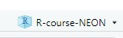
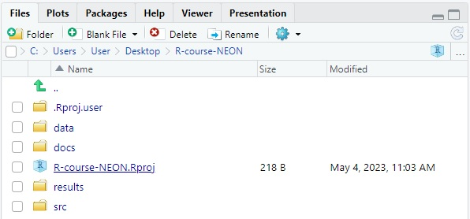

```{r, include = FALSE, purl = FALSE}
# Functions and data
source("src/setup.R")

# get chapter number based on name
chp_num <- get_chpNum("chp-computer-navigation", type = "fileName")
chp_str <- ifelse(nchar(chp_num) > 1, chp_num, paste0("0", chp_num))

# knitr options
source("src/knit-options.R")
knitr_fig_path(paste0("../../", chp_str, "-"))

# Silently set seed for random number generation, so we don't have to explain it
set.seed(10)
```

# Chapter `r chp_num`. `r get_chpName(chp_num, type.to = "nameLong")` {.tabset}

**THIS LESSON IS NOT YET READY FOR LEARNERS.**

## Overview 

<!--### Motivator-->

> How much time have you wasted wondering just where that file you downloaded went or which version of a paper you were working on? Have you ever forgotten exactly what you did to make that graph for a report and now need to make it again?

A modern scientist must not only learn how the natural world works- they also must be able to access and interact with the digital world through a computer. However for many scientists, a computer is a somewhat mysterious box of electronics that we learn how to interact with in a piecemeal fashion, gradually learning the tools we need to do our science. While most scientists don't need to learn how the physical hardware of their computer works, learning a little bit about how the software that is programmed into our computers is structured can make it much easier to create reproducible science in a world where all data eventually becomes digital.

We're going to get to know your computer by learning to navigate the file system through a command line. In doing so, we will set up a digital project that we will use for the rest of the chapters in this book. Keeping your computer's files tidy and organized is the first step toward reproducible science and will save you time and energy. 

A good project layout will ultimately make your life easier:

* It will help ensure the integrity of your data;
* It makes it simpler to share your work with someone else
(a lab-mate, collaborator, or supervisor);
* It makes it much easier to pick the project back up after a break.

To understand how to set up a tidy project layout, we first need to understand how your computer is structured.


### What we will learn

In this lesson 
`r get_LO(as.numeric(chp_num), LOtable, prefix = TRUE)`

#### Key Terms & Commands

You will learn these key terms as you work through this lesson:

* file
* file system
* file path (relative vs. absolute)
* directory
* working directory vs. root directory
* terminal

This lesson introduces the following unix-style shell commands:

* `/`
* `./`
* `../`
* `cd`
* `ls`
* `pwd`
* `cp` 
* `mkdir`
* `rm`

### Prerequisites

We could learn about your computer's **file system** using applications that are already installed on your computer; e.g. the File Explorer on Windows or the Finder on Mac. However, we'll be using RStudio to explore files on your computer because it has a built-in command-line environment and file viewing window that we can use from the same application. We'll also be using RStudio to create a self-contained, reproducible project that we will use for the rest of this book. 

Before beginning this lesson, make sure that your have the latest version of R and RStudio (see [Computer Setup](computer-setup.html)) and that you know how to open your computers default file browser.


## Lesson

### Orientation to the RStudio user interface

Let's begin by opening RStudio. Find the RStudio application on your computer and open it as you would any other application.

**Basic layout**

When you first open RStudio, you will be greeted by three panels:

  * The interactive R console/Terminal (entire left)
  * Environment/History/Connections (tabbed in upper right)
  * Files/Plots/Packages/Help/Viewer (tabbed in lower right)

Your RStudio session should look similar to this:


We will go over each of these panels as we need to use them. For this lesson, we will be using the `Files` and `Terminal` panels to learn how to navigate your computer. We will learn more about the `Console` and `Environment` panels in the [Intro to R and RStudio](chp-intro-to-R.html) lesson.


### Navigating the file system

A computer can do a lot of things, but one of its most basic functions is to store **files**, encoded pieces of information that you can interact with (e.g. documents, images, programs, etc...). A computer organizes these files in a hierarchical **file system** that helps the user know where to find them. The file system contains folders and sub-folders that allow the user to sort files according to their needs. The file system is "hierarchical" because folders and files are always contained within a folder at a higher level.

Another name for a folder on the file system is a **directory** and there are a few special directories that you should know about:

* The **root directory** is the highest level folder on the file system.
* The **working directory** is the folder that you are currently working in.

Open the file browser that you use to access files on your computer. On Mac this is usually the Finder application (). On Windows this is the File Explorer application (). 

Use your file browser to navigate to a folder where you typically save files for school (or work). Keep track of the sequence of folders that you clicked through to get there. The sequence of sub-folders used to navigate to a particular file or folder is called a **path** or **file path**. A path is an address that tells a computer where to find a specific file or directory. An **absolute path** is the full address of a file or folder starting from the root directory. On the Windows File Explorer, the path is shown in a bar across the top of the window. On the Mac Finder, the path is shown in a bar across the bottom of the window (if it is not there, you need to enable it by clicking View > Show Path Bar). The `>` symbol is typically used to separate sequential subfolders; the highest level folder is the left-most and the name of the folder you are currently looking at is the right-most. 

Let's use the `Files` panel in RStudio to view the file system. When you first open RStudio the contents of the working directory are shown in the `Files` panel. The absolute path of the current directory you are viewing is shown in a bar across the top. To navigate up or down the file system and view files in different folders, you can click on the names of higher-level folders in the path or you can click on subfolders inside the the window. 

::: {.challenge}
Find your Downloads folder

When you download a file from the internet where does it go? Most computers have a default directory where downloaded files are saved. It can be very useful to know where this directory is located on your file system.

1. Use the file browser on your computer (Finder on Mac or File Explorer on Windows) to locate your default Downloads folder. What path does your file browser give for this folder?
2. Now use the file browser built into RStudio to find the same Downloads folder. If you have trouble navigating using the RStudio file explorer, click on the three dots in the upper right corner of the `Files` panel to use your computer's default file browser.
3. Type out the absolute path to your downloads folder.
:::


### Using the command line to navigate

The first step in to learning to write programs is learning how to navigate the file system using text commands. A computer has a program called a **shell** that can interact with the file system (e.g. create, edit and delete files and directories). We will use a **terminal** to interact with this shell. The terminal provides a graphical window so we can see the commands that we type to the shell and the output these commands produce. We're going to learn a few commands used in unix-style shells because these are the ones typically used by scientists for computing. RStudio uses a unix-style shell regardless of your computer's operating system (e.g. Windows or Mac). 

Open the terminal in RStudio. It should be listed as a tab in the left panel. If not, use the top menu bar to select View > Move Focus to Terminal.

You should see `$` followed a blinking cursor. This is the **command line**. It is where we will type commands to tell the shell how to interact with the file system.

The colored line of text above or to the left of the command line gives your username and your computer's name as well as the path to your current **working directory**. Notice that subfolders in the path are separated by slashes `/`. The path also begins with a `~`. This denotes that the path is relative to the user's **home directory**. A home directory is the folder where all of a particular user's documents are stored. A computer can have multiple users who log in using different usernames. Each user will have a different home directory.

What is the absolute path of the current working directory (the directory we are currently in)?

Type `pwd` into the command line (stands for "present working directory"). Press <kbd>Enter</kbd>.

The terminal will print some text with the absolute path to the current working directory. It will start with a `/` to denote the root directory and subfolders will be separated by forward slashes `/`. 

What files and folders are in this directory? To see, type `ls` into the command line and press <kbd>Enter</kbd> to "list" the files.

The names of files will be in black and the names of directories will be in a different color and will end with a `/`.

Let's navigate into a subfolder. Type the command `cd` followed by the name of a subfolder to "change directories" to that folder. If there are spaces in the name of the folder, you need to surround the folder name with quotes: For example `cd Documents` or `cd "My Documents"`.

Now what is the current working directory? Check using the `pwd` command.

To go back up a level to the next higher directory (called the **parent directory**), use `../`: 

`cd ../`

In fact, we can use `cd` to navigate to any folder by typing its absolute path after the `cd` command. For example: `cd "/c/Documents/My subfolder/another subfolder"`. 

FYI: You can get your file browser to display the text-based file path to any folder as follows:

* Windows: Click inside the file path bar. The absolute path will be displayed using a backslash '\' symbol between sequential subfolders. For example: `C:\Users\username`. You need to change the back slashes to forward slashes before using it in the command line.
* Mac: ctr+click on the file you want inside the Finder path bar. Select Copy as Pathname and paste it into the command line as is.

::: {.challenge}
Navigate to your Downloads folder

1. Write a command that would navigate directly to your Downloads folder no matter what directory you are currently in.
2. Try it out from your current working directory to see if it works.
:::


Rather than type out the full absolute path every time we need to navigate to a new folder, we can use a **relative path** to specify the location of a file or folder relative to the current working directory.

The current working directory is denoted `./`, so `./Documents` specifies the Documents subfolder within the current working directory. In contrast `../Documents` specifies a Documents folder that is located in the next folder above the current working directory. So since `../` is the parent, `../Documents` would be a sibling directory of the current working directory.


::: {.challenge}
Navigate to your Downloads folder

1. Write a command that would navigate to your Downloads folder from your Home directory.
2. Navigate to your Home directory and try it out.
:::

::: {.callout-trick}

You don't need to type out long file path names at the command line. Start by typing a few letters of the file path your want, then press tab. If there is only one name in the current directory that starts with those letters, the command line will automatically complete the name for you. If nothing appears, try typing a few more letters and pressing tab again, or check to make sure your spelling is correct. This is called **tab completion** and can be used throughout RStudio. 

If your Terminal window gets stuck and the command line looks like this `>` that means it is waiting for further input. If you didn't mean to add anything else, you can **escape** the current command and reset the command line by typing <kbd>ctrl</kbd> + <kbd>c</kbd> (Windows) or <kbd>cmd</kbd> + <kbd>c</kbd> (Mac).
:::


### Creating an RStudio project

RStudio projects are a useful way to keep all of the files needed for a particular project together in one place. RStudio projects can be easily shared with others because they set up the RStudio session in the same way regardless of who opens the project. 

::: {.challenge}
Create a new project in RStudio

1. Click the "File" menu button, then "New Project".
2. Click "New Directory".
3. Click "New Project".
4. Type in the name of the directory to store your project. This can be any name using letters or numbers, but it should not have any spaces. For example, try "my-sandbox".
5. Click the "Create Project" button.
:::

You should now be looking at a new RStudio session and in the upper right corner of the window you will see this the name of your project:


You will also see a mostly empty folder in the Files panel. There should be one file with the name of the project: my-sandbox.Rproj

This file contains information that RStudio needs to set up your project. One thing the .Rproj file will do is set your working directory to be the same directory that the .Rproj file is located in. Let's see how this works.

::: {.challenge}
Display the working directory in the Terminal and R Console

What command should you use in the terminal to display the path of the current working directory?

:::
::: {.solution}
```{bash eval = FALSE}
  pwd
```
:::

We can also show the working directory in the R Console. Click the Console tab next to the Terminal tab. This command line let's you interact with R (which we will learn more about in future chapters). Notice that the command line begins with `>`.

::: {.challenge}
Display the working directory in the R Console.

1. Type `getwd()`.
2. What do you see? How is it similar to and different from what the Terminal displays?
3. How would the file path be different on someone else's computer? How would it be similar?
:::

RStudio projects are useful because they automatically open in the same working directory regardless of the computer they are located on. This means that when we start writing code, we can refer to the location of files relative to the directory where the .Rproj file is saved and the code will work on any computer. Let's see how this might work.


::: {.challenge}
Opening an RStudio project through the file system

1. Exit RStudio.
2. Use your computer's file browser to navigate to the directory where you created the my-sandbox project. This should be your Desktop folder if you followed the steps above.
3. Move the entire my-sandbox folder to a folder on your computer where you are saving work for this class.
4. Open the my-sandbox folder and double click on the `.Rproj` file in that directory.
5. Observe the Files panel in RStudio. What has changed?
6. Use the Terminal and the R Console to display the current working directory. What has changed?
:::

#### Best practices for project organization

Although there is no "best" way to lay out a project, there are some general
principles to adhere to that will make project management easier:

[Good Enough Practices for Scientific Computing](https://github.com/swcarpentry/good-enough-practices-in-scientific-computing/blob/gh-pages/good-enough-practices-for-scientific-computing.pdf) gives the following recommendations for project organization:

1. Put each project in its own directory, which is named after the project.
2. Put text documents associated with the project in the `doc` directory.
3. Put raw data and metadata in the `data` directory, and files generated during cleanup and analysis in a `results` directory.
4. Put source for the project's scripts and programs in the `src` directory, and programs brought in from elsewhere or compiled locally in the `bin` directory.
5. Name all files to reflect their content or function.

The workbook for this course is an RStudio project that follows these guidelines. If you haven't already done so, [set up the workbook for this course](computer-setup.html##Course-Workbook).

Close RStudio and use your computer's file browser to navigate to the directory where you saved the R-course-NEON-workbook project. Open the project by clicking on the .Rproj file.

The Files panel in RStudio should now look like this:
> 

The exercises folder contains files that you will use to complete the exercises at the end of each lesson. These are text files that you can edit to solve the problems described in the Exercises section. Let's make a copy of each of these files so that if you make changes to them, you still have the original version. Although you could do this with your file browser, we will learn how to do this using the terminal in order to introduce some useful new commands.


### Working with files on the command line
<!-- set the chunk working directory to the workbook to mirror what the student sees -->
```{r include = FALSE}
setwd_workbook(TRUE)
```

The terminal provides a quick way to create and remove files and directories. It is particularly useful to use the terminal when we need to work on a lot of files at once.

Let's use the terminal to create two new folders: one for copies of the exercises that you are working on and one for the exercise files once you have finished them. The command to "make a directory" is `mkdir` followed by the name of the folder you wish to create.

Execute the command `mkdir working` in the terminal. (To "execute" a command, type it at the command prompt and press <kbd>Enter</kbd>.)

```{sh}
mkdir working
```

Where did the new directory end up? It should have been created in the current working directory. However, it would be more logical to place this directory inside the exercises folder. You could navigate to the exercises folder and then run the `mkdir` command again, or you can specify the path to the new folder you wish to create.

Create a new folder called working inside the exercises folder by executing this command in the terminal:

```{sh}
mkdir exercises/working
```

Check the Files window to verify that you created a folder named working inside the exercises folder.

::: {.challenge}
Create a new folder

Use the terminal to make a new folder named "finished" inside the exercises folder.
:::
::: {.solution}
```{sh}
mkdir exercises/finished
```
:::


::: {.callout-trick}
If you want to rerun a similar command, you don't need to type it out again. Place your cursor at the command line and press the up arrow key. This will bring up the most recent command, If you press it again, it will go back through your commands one at time. When you find the one you want, you can run it as-is by pressing <kbd>Enter</kbd> or edit it first, then run it.
:::

Let's remove the working folder that we not longer need that is not in the exercises folder. The command to "remove" a file or folder is `rm`. 

```{sh}
rm working
```

Oops it didn't work! You got an error message saying that it could not remove working because it is a directory. We need to add an option to allow the function to "recursively" delete sub directories and files within them. Command options are specified after the command with a `-`. The command to delete the directory named working and all of its contents is:

```{sh}
rm -r working
```


What else can the `rm` command do? Are there any other options? If you're interested in learning about the functionality of a unix command, you can always use the internet, but there is also a built-in help file attached to every command. Use the `--help` option to access it. 


```{sh}
rm --help
```


We see a table of the different options and then at the end tells us: "By default, rm does not remove directories. Use the --recursive (-r or -R) option to remove each listed directory, too, along with all of its contents."

Now let's copy the exercises for lesson 1 into exercises/working. The command to copy a file is `cp SOURCE DEST`, where we replace `SOURCE` with the name(s) of the files to copy and `DEST` with the name of the directory to copy them into.

First we need to know the names of the files.

::: {.challenge}
Use the terminal to list all of the files in the exercises folder.

:::
::: {.solution}
Your answer will depend on your current working directory (check using `pwd`):

If your working directory is the main R-course-NEON-workbook folder, then type:
```{sh eval = FALSE}
ls exercises
```
If your working directory is the R-course-NEON-workbook/exercises folder, then type:
```{sh eval = FALSE}
ls 
```
:::

When the list of files prints, you will see that each exercises is named according to its number. All of the exercises for lesson 1 start with 1.

Let's copy one of the files from the exercises folder into the working subfolder. Note that this code assumes you are in the main R-course-NEON-workbook folder.

```{sh}
cp exercises/1.1.txt exercises/working/

```

Notice the `/` at the end of the name of the folder. If we had typed `cp 1.1.txt exercises/working`, it would have copied 1.1.txt into a new file named exercises and overwritten the folder named exercises.

Use the Files window in RStudio to check to see that this worked. There should now be a file named 1.1.txt inside the working subfolder of the exercises folder.

The real power of the terminal is that it lets us work with many files at once, instead of copying them one at a time. Let's copy all of the exercise files for lesson 1 into the working folder.

We will use a **wildcard** to select only the files that begin with the number 1. The `*` symbol is used to match any character. `ls 1.*` would list all files that begin with 1. inside the current working directory. 

First let's move into tho exercises folder so that we don't need to include the exercises folder in the command. Then, list all files that begin with 1.
```{sh}
cd exercises

ls 1.*
```

Wildcards can be used with other commands and allow us to copy and move a set of files that match a particular naming pattern. 

::: {.challenge}
1. Use the terminal to check your current working directory and navigate to the exercises folder (if needed).
2. List the files for exercises in lesson 1 (these begin with 1.).
3. Copy these files into the working folder inside the exercises folder.
:::
::: {.solution}
Commands are shown below without their output.
```{sh eval = FALSE}
pwd

cd exercises

ls 1.*

cp 1.* working/

```
:::

Be careful- if you copy a file into a directory where a file with the same name exists, it will automatically write over the file (unless you use an option to tell it not to, see `cp --help` for more information).


Rename with your initials.  (use variable assignment)


Open the first exercise.

<!-- remove things made during the script rendering-->
```{sh include = FALSE}
rm -r exercises/finished
rm -r exercises/working
```

```{r include = FALSE}
setwd_workbook(FALSE)
```

### FYI: Additional info for the curious


#### More useful Unix commands

head
echo
wc

--help


## Exercises

After completing these exercises, learners will be able to 
`r get_LO(as.numeric(chp_num), CStable, prefix = TRUE, bullet = "1.")`


**`r chp_num`.1** Explore the Student Workbook for this course on your computer.

1. Open the course workbook RStudio project using the .Rproj file.
2. Use the File panel in RStudio to explore the directory structure of this project.
4. Write out the absolute path of the initial working directory and the command you typed into the **R Console** to determine this.
5. From the initial working directory...
    1. Write out the relative path to the data file XXX.
    2. Write out the relative path to the folder where you should save completed exercises.

**`r chp_num`.2** Where is your Desktop directory located on your computer's file system?

1. Write out the absolute path to your Desktop directory.
2. Write out a relative path to your Desktop directory from your Home directory.
3. What would you type into the Terminal to navigate from your Home directory to your Desktop directory?

**`r chp_num`.3** From the initial working directory of the Student Workbook RStudio project...

1. What would you type into the Terminal to show all files in the data directory?
2. How would you modify this command so that the size of each file is shown?

**`r chp_num`.4** From the initial working directory of the Student Workbook RStudio project, **use the Terminal to**:

1. Create a new directory inside the data directory named "derived"
2. Move a copy of the file intro-to-R_dat.csv into this new "derived" folder and append today's date to the end of the file name in the format YYYY-MM-DD (e.g.: intro-to-R_dat_2023-05-13.csv). Remember- avoid using spaces in file names!
3. Rename this file to add your initials to the end of the file name (e.g. intro-to-R_dat_2023-05-13_JRC.csv)
4. Delete the derived directory and all of its contents.
5. Type out the commands (in order) that you used to accomplish the prior steps. Write one command line for each of the four steps.


## Sources and Resources

This lesson was adapted from [@swc-reproducible-lesson](https://swcarpentry.github.io/r-novice-gapminder/) episodes 1 & 2 by Jes Coyle.

### Additional Resources

Read more about using the Terminal in RStudio [here](https://support.posit.co/hc/en-us/articles/115010737148-Using-the-RStudio-Terminal-in-the-RStudio-IDE).

### Cited References


<!-- javascript that formats solution blocks clickable hidden text -->
```{js, file = "format_fences.java"}

```
