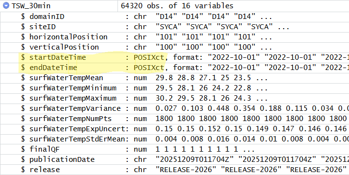

```{r, include = FALSE, purl = FALSE}
# Functions and data
source("src/setup.R")

# get chapter number based on name
.chp <- "functions"
.chp_num <- .get_chpNum("chp-functions", type = "fileName")
.chp_str <- ifelse(nchar(.chp_num) > 1, .chp_num, paste0("0", .chp_num))

# knitr options
source("src/knit-options.R")
.knitr_fig_path(paste0(.chp_str, "-"))

# Silently set seed for random number generation, so we don't have to explain it
set.seed(10)

# Load neonUtilities
library(neonUtilities)
```

# Chapter `r .chp_num`. `r .get_chpName(.chp_num, type.to = "nameLong")` {.tabset}

## Overview 

> Have you ever completed a complicated series of steps in an analysis only to discover that some small part of your initial data were incorrect? Oh no! Hours wasted... but not if your analyses were written in computer code that could be run on the new data with the click of a button. 


A critical step in the scientific process is to update our models when new data become available- whether those data are corrections to prior mistakes or genuinely new information that we can used to make better predictions. Re-useable computer code is critical for automating this process and the workhorse of computer programming is the *function*.

In this lesson, we'll learn how to write a function so that we can repeat
several operations with a single command.


### What we will learn

In this lesson 
`r .get_LO(.chp, .LOtable, prefix = TRUE)`

#### Key Terms & Commands

* function name, body and arguments
* default values
* vectorized
* element-wise vs. matrix multiplication
* vector recycling


### Prerequisites

Before beginning this lesson you should have completed the lesson [`r .get_chpName("data-structures", type.from = "chp")`](chp-data-structures.html) and any prerequisites therein.

Before you begin:

1. Open the R-course-NEON-workbook RStudio project.
2. Create a new R script named `r paste0("lesson_", .chp_str, "_code.R")` in the lesson-code folder of the student workbook.
3. Whenever you see R code like this:

```{r eval = FALSE}
Type (or copy) this into your R script. Then run it in the Console.

```

4. Whenever you see a challenge like this:

:::{.challenge}

Try to solve the problem by writing R code into your script. Check your answer by clicking:

<details><summary>**Solution:**</summary>

::: {.solution}

```{r eval = FALSE}
The code that solves the challenge will appear here.
```

Along with an explanation.

:::

</details>

:::

<br>


4. Be sure to click **Save** often to save your work.

## Lesson


### What is a function?

Just like in mathematics, functions take an input and convert that input into a different output. In programming, we use functions because they can gather a sequence of operations into a whole, preserving it for ongoing use. Functions provide:

* a name we can remember and invoke it by
* relief from the need to remember the individual operations
* a defined set of inputs and expected outputs

Functions are always followed by parentheses that enclose their arguments:

`function_name(argument1, argument2)`

You have already met several functions in R. Do you remember what each of these functions do?

```{r eval = FALSE}
sum(1:6)

mean(1:10)

c(2, 4, 6)

seq(2, 10, by = 2)

tempdata <- read.csv("data/NEON_water/watertemp_30min_TECR_2021-04_2021-10.csv")

rm(tempdata)

```

Some functions will **return** a value or object that is either printed to the console or can be saved to a new object. Other functions perform a set of operations without returning any values or objects.

::: {.challenge}
Which of the functions above return an object? What type of object is returned?

<details><summary>**Solution:**</summary>

::: {.solution}

```{r}
# returns a single number
sum(1:6) 

# returns a single number
mean(1:10) 

# returns a vector
c(2, 4, 6) 

# returns a vector
seq(2, 10, by = 2) 

# returns a data frame (which we saved to a new object tempdata)
tempdata <- read.csv("data/NEON_water/watertemp_30min_TECR_2021-04_2021-10.csv") 

# does not return any object, but removes the object tempdata
rm(tempdata) 

```

:::

</details>

:::

<br>

The help page of a function tells us what type of object a function should return and the names of the arguments it accepts. Let's read the help file for `read.csv()`.

```{r eval = FALSE}

?read.csv

```

The Description field tells us that we should expect this function to create a data frame. In the Usage section we see several related functions for reading tabular data files. The most general version of this function is `read.table()`. The `read.csv` function can actually accept all of the same arguments as `read.table()` (because of the `...`). From this documentation page, we see that `read.csv()` is actually a shorthand for `read.table()` with a few different **default values** for arguments. Specifically:

| argument | `read.table()` | `read.csv()`|
|----------|----------------|-------------|
| `header` | `FALSE`        | `TRUE`      |
| `sep`    | `""`           | `","`       |
| `quote`  | `"\"'"`        | `"\""`      |
| `fill`   | `!blanklinesskip` | `TRUE`   |
| `comment.char` | `"#"`    | `""`        |

Farther down in the documentation, each of these arguments is described in detail. For example, the `quote` argument defines which quotation characters are used to denote text. For `read.table()`, both `"` and `'` are allowed, whereas for `read.csv()` only `"` is used. (The `\` character is used to "escape" the usual meaning of the `"` so that the `"` character itself can be specified inside a set of quotes: `" " "`.)

In R, function arguments may be specified in any order, so long as the names of the arguments are used. If the argument names are not used, then the function arguments are assumed to be in the same order as shown on the help page. 


::: {.challenge}
Open the help page for the function `rep()`. And these this infromation to answer the following:

1. What arguments does this function take?
2. What will be the output of each of the following:

```{r eval = FALSE}

rep(1:3, 2)

rep(1:3, each = 2)

rep(length.out = 4, x = 1:3)

```

<details><summary>**Solution:**</summary>

::: {.solution}

Use `?rep` to open the documentation page.

The `rep()` function takes several arguments in this order:

|       `x` = the vector of values to be repeated.
|       `times` = a vector of integers giving the number of times to repeat each element of `x`
|       `length.out` = an integer specifying the number of elements in the vector to be returned.
|       `each` = an integer specifying the number of times to repeat each element of `x`

```{r}

rep(1:3, 2)

rep(1:3, each = 2)

rep(length.out = 4, x = 1:3)

```

:::

</details>

:::

<br>


### Vectorization

Most of R's functions are vectorized, meaning that the function will operate on each element of a vector and return a new vector of the same length. This makes writing code more concise, easy to read, and less error prone.

You are actually already familiar with this behavior:


```{r}
x <- 1:4
x * 2
```

The multiplication happened to each element of the vector.

We can also add two vectors together:

```{r}
y <- 6:9
x + y
```

Each element of `x` was added to its corresponding element of `y`:

```{r, eval=FALSE}
x:  1  2  3  4
    +  +  +  +
y:  6  7  8  9
---------------
    7  9 11 13
```

Logical comparisons and many functions are also vectorized:

```{r}
x > 2

x == 4

x %in% 1:10
```

Most base functions also operate element-wise on vectors:

```{r}
x <- 1:4
log(x)
```

Vectorized operations work element-wise on matrices:

```{r}
m <- matrix(1:12, nrow=3, ncol=4)
m * -1
```

::: {.callout-tip}
**Element-wise vs. matrix multiplication**

The operator `*` gives you element-wise multiplication!
To do real matrix multiplication, we need to use the `%*%` operator:

```{r}
m %*% matrix(1, nrow=4, ncol=1)
matrix(1:4, nrow=1) %*% matrix(1:4, ncol=1)
```

:::


::: {.challenge}

Given the following matrix:

```{r}
m <- matrix(1:12, nrow=3, ncol=4)
m
```

Write down what you think will happen when you run:

```{r eval = FALSE}
m ^ -1

m * c(1, 0, -1)

m > c(0, 20)

```

<details><summary>**Solution:**</summary>

::: {.solution}

```{r}
m ^ -1

m * c(1, 0, -1)

m > c(0, 20)

```

:::

</details>

:::

<br>


::: {.challenge}

We're interested in looking at the sum of the following sequence of fractions:

```{r, eval=FALSE}
x = 1/(1^2) + 1/(2^2) + 1/(3^2) + ... + 1/(n^2)
```

This would be tedious to type out, and impossible for high values of n.  Use vectorization to compute x when n=100. 

<details><summary>**Solution:**</summary>

::: {.solution}

```{r}

# Sum of the inverse squares of the numbers from 1 to 100
sum(1/(1:100)^2)

# Alternatively, for any n:
# Sum of the inverse squares of the numbers from 1 to n
n <- 10000
sum(1/(1:n)^2)
```


:::

</details>

:::

<br>


::: {.callout-tip}
**Operations on vectors of unequal length**

Operations can also be performed on vectors of unequal length, through a process known as **recycling**. This process automatically repeats the smaller vector until it matches the length of the larger vector. R will provide a warning if the larger vector is not a multiple of the smaller vector.

```{r}
x <- c(1, 2, 3)
y <- c(1, 2, 3, 4, 5, 6, 7)
x + y
```

Vector `x` was recycled to match the length of vector `y`
 
```{r, eval=FALSE}
 x:  1  2  3  1  2  3  1
     +  +  +  +  +  +  +
 y:  1  2  3  4  5  6  7
 -----------------------
     2  4  6  5  7  9  8
```
:::


### Writing your own functions

Functions and objects are the the basic building block of most programming languages, Therefore, if you have written a function, you are a computer programmer. Let's become programmers!

First, make a new directory in your `R-course-NEON-workbook` folder to contain final code that you plan to reuse. Let's call it `src`, which stands for "source". 

Open a new R script file and call it `functions.R`. Save this file in the `src` folder. We will use this script to save functions that could be useful across several analyses.

The general structure of a function is:

```{r}
my_function <- function(arguments) {
  # perform action
  # return value
}
```

Let's define a function `fahr_to_kelvin()` that converts temperatures from
Fahrenheit to Kelvin. Write this function in your `functions.R` script.

```{r}
fahr_to_kelvin <- function(temp) {
  # Calculate temp in kelvin
  kelvin <- ((temp - 32) * (5 / 9)) + 273.15
  
  # Return the value of kelvin
  return(kelvin)
}
```

We define `fahr_to_kelvin()` by assigning it to the output of `function`. The list of argument names are contained within parentheses. Next, the body of the function--the statements that are executed when it runs--is contained within curly braces (`{}`). The statements in the body are indented by two spaces. This makes the code easier to read but does not affect how the code operates.

It is useful to think of creating functions like writing a cookbook. First you define the "ingredients" that your function needs. In this case, we only need one ingredient to use our function: "temp". After we list our ingredients, we then say what we will do with them, in this case, we are taking our ingredient and applying a set of mathematical operators to it.

When we call the function, the values we pass to it are assigned to the arguments, which become variables inside the body of the function. We can then manipulate these variables inside the function. Inside the function, we use a return statement at the end to send a result back to the environment where the function was called. This `return()` function is optional in R (though not in most other programming languages). R will automatically return the results of whatever command is executed on the last line of the function.

::: {.challenge}
Which parts of the `fahr_to_kelvin()` function above are the **function name**, **arguments**, and **body**?

<details><summary>**Solution:**</summary>

::: {.solution}

The function name is `fahr_to_kelvin`.

The single argument is `temp`.

The body is the code:

```{r eval = FALSE}
  # Calculate temp in kelvin
  kelvin <- ((temp - 32) * (5 / 9)) + 273.15
  
  # Return the value of kelvin
  return(kelvin)


```

:::

</details>

:::

<br>


Let's try running our function.
Calling our own function is no different from calling any other function:

```{r}
# Calculate the freezing point of water in kelvin
fahr_to_kelvin(32)
```

```{r}
# Calculate the boiling point of water in kelvin
fahr_to_kelvin(212)
```

::: {.challenge}

Write a function called `kelvin_to_celsius()` that takes a temperature in Kelvin and returns that temperature in Celsius.

Hint: To convert from Kelvin to Celsius you subtract 273.15

<details><summary>**Solution:**</summary>

::: {.solution}

```{r}
kelvin_to_celsius <- function(temp) {
  celsius <- temp - 273.15
  return(celsius)
}
```

:::

</details>

:::

<br>

::: {.callout-important}

**What's going on inside a function?**

Functions in R almost always make copies of the data to operate on inside of a function body. When we modify `dat` inside the function we are modifying the copy of dataset supplies as `dat`, not the original variable we gave as the first argument.

This is called "pass-by-value" and it makes writing code much safer: you can always be sure that whatever changes you make within the body of the function, stay inside the body of the function.

Another important concept is scoping: any variables (or functions!) you create or modify inside the body of a function only exist for the lifetime of the function's execution. When we call `kelvin_to_celsius()`, the variables `temp` and `celsius` only exist inside the body of the function. Even if we have variables of the same name in our interactive R session, they are not modified in any way when executing a function.

You can see this by typing `celsius` into the console:
```{r}
celsius
```

:::

### Functions with multiple arguments

We can also define functions that perform operations on multiple arguments, which are separated by commas. Let's write a function that returns the upper and lower bounds of uncertainty around a given value.

```{r}
# A function that returns the lower and upper uncertainty bounds
# around a given values as a 2-column matrix
# Arguments:
#   mu = a vector of values around which bounds should be calculated
#   sigma = a vector containing the amount of uncertainty (in the same units as mu)

calc_uncertainty <- function(mu, sigma) {
  
  # Calculate the upper bound
  upper <- mu + sigma

  # Calculate the lower bound
  lower <- mu - sigma
  
  # Combine the bounds into a matrix
  bounds <- cbind(lower, upper)
  
  # Return the matrix
  return(bounds)
}

```


Let's try out our function:

```{r}
calc_uncertainty(mu = 0, sigma = 2)

calc_uncertainty(mu = 1:10, sigma = 0.5)

calc_uncertainty(mu = 0, sigma = 1:10)

```


::: {.challenge}

Modify the `calc_uncertainty()` function so that it returns a three-column matrix that includes the central value (`mu`) in addition to the upper and lower bounds.


<details><summary>**Solution:**</summary>

::: {.solution}

We added `mu` to the line where we define the `bounds` object which is returned:

```{r}
# A function that returns the lower and upper uncertainty bounds
# around a given values as a 3-column matrix
# Arguments:
#   mu = a vector of values around which bounds should be calculated
#   sigma = a vector containing the amount of uncertainty (in the same units as mu)

calc_uncertainty <- function(mu, sigma) {
  
  # Calculate the upper bound
  upper <- mu + sigma

  # Calculate the lower bound
  lower <- mu - sigma
  
  # Combine the bounds into a matrix
  bounds <- cbind(lower, mu, upper)
  
  # Return the matrix
  return(bounds)
}

```

:::

</details>

:::

<br>

### Vectorizing functions

Some functions do not work element-wise on vectors in the way that we need them to. Consider the `calc_uncertainty()` function we wrote. By default it will recycle the `mu` and `sigma` vectors if they are not equal length:

```{r}
calc_uncertainty(mu = 1:4, sigma = c(0, 10))
```
The code above alternates applying `sigma = 0` and `sigma = 10` to the numbers `1`, `2`, `3`, `4`, sequentially. But, what if we actually wanted each value in the `sigma` vector to be applied to each value in the `mu` vector?

One way to do this is to **vectorize** the `calc_uncertainty()` function along the `mu` argument and give it a new function name (`Vcalc_uncertainty()`):


```{r}
Vcalc_uncertainty <- Vectorize(calc_uncertainty, "mu", SIMPLIFY = "array")

Vcalc_uncertainty(mu = 1:4, sigma = c(0, 10))

```
The result is an array with three dimensions. The third dimension has the same length as the vector we supplied for the argument `mu`.

::: {.challenge}

What would the dimensions of the resulting array be if we vectorized along the `sigma` argument?

```{r eval = FALSE}
Vcalc_uncertainty <- Vectorize(calc_uncertainty, "sigma", SIMPLIFY = "array")

Vcalc_uncertainty(mu = 1:4, sigma = c(0, 10))

```


<details><summary>**Solution:**</summary>

::: {.solution}

The third dimension of the array will have the same length as the vector we supply for the `sigma` argument.

```{r echo = FALSE}
Vcalc_uncertainty <- Vectorize(calc_uncertainty, "sigma", SIMPLIFY = "array")

Vcalc_uncertainty(mu = 1:4, sigma = c(0, 10))
```


:::

</details>

:::

<br>

### Combining functions

The real power of functions comes from mixing, matching and combining them into ever-larger chunks to get the effect we want.

Let's write a function that will convert from Fahrenheit to Celcius using  the two functions that we already wrote for converting Fahrenheit to Kelvin (`fahr_to_kelvin`) and Kelvin to Celsius (`kelvin_to_celcius`, see challenge above)

```{r}
fahr_to_celsius <- function(temp) {
  
  temp_k <- fahr_to_kelvin(temp)
  temp_c <- kelvin_to_celsius(temp_k)

  return(temp_c)
}

```

::: {.challenge}

Verify that our new function works by calculating the freezing and boiling points of water in Celcius.

<details><summary>**Solution:**</summary>

::: {.solution}

```{r}

# Freezing point of water
fahr_to_celsius(32)

# Boiling point of water
fahr_to_celsius(212)

```

:::

</details>

:::

<br>

### Default values

Sometimes it is useful to provide default values for some of a functions arguments. These are the values that the function will use if the user does not specify a value for the argument.

For example, look what happens if we call `calc_uncertainty()` without specifying `sigma`:

```{r error = TRUE}
calc_uncertainty(0)

```

Let's add a default value of `0` for sigma.

```{r}
# A function that returns the lower and upper uncertainty bounds
# around a given values as a 2-column matrix
# Arguments:
#   mu = a vector of values around which bounds should be calculated
#   sigma = a vector containing the amount of uncertainty (in the same units as mu)

calc_uncertainty <- function(mu, sigma = 0) {
  
  # Calculate the upper bound
  upper <- mu + sigma

  # Calculate the lower bound
  lower <- mu - sigma
  
  # Combine the bounds into a matrix
  bounds <- cbind(lower, upper)
  
  # Return the matrix
  return(bounds)
}
```

Now let's test it:

```{r}
calc_uncertainty(1:5)

```


### Organizing code and functions

Now that we have a final working version of the functions we created, let's get organized:

::: {.callout-tip}
**Separate functions from analyses**

One of the more effective ways to work with R is to start by writing the code you want to run directly in a .R script, and then running the selected lines (either using the keyboard shortcuts in RStudio or clicking the "Run" button) in the interactive R console.

When your project is in its early stages, the initial .R script file usually contains many lines of directly executed code. As it matures, reusable chunks get pulled into their own functions that are saved as separate code scripts. It's a good idea to separate these code scripts into two separate folders; one to store useful functions that you'll reuse across analyses and projects, and one to store the functions and analyses that are specific to a particular project.

:::


If you haven't already done so, create a new R script file in the `src` directory of your `R-course-NEON-workbook` folder and call it `functions.R`. 

Let's place the code for the working functions that we have created in this lesson into this script. The functions you should have are: `fahr_to_kelvin()`, `kelvin_to_celsius()`, `fahr_to_celsius()`, `calc_uncertainty()`. Each function should be preceded by a comment that describes what it does and what its arguments are. 


<details><summary>**Click here to see what your script should contain**</summary>

```{r}

# A function that converts a vector of temperatures from
# fahrenheit to kelvin
fahr_to_kelvin <- function(temp) {
  # Calculate temp in kelvin
  kelvin <- ((temp - 32) * (5 / 9)) + 273.15
  
  # Return the value of kelvin
  return(kelvin)
}

# A function that converts a vector of temperatures from
# kelvin to celsius
kelvin_to_celsius <- function(temp) {
  celsius <- temp - 273.15
  return(celsius)
}

# A function that converts a vector of temperatures from
# fahrenheit to celsius
fahr_to_celsius <- function(temp) {
  
  temp_k <- fahr_to_kelvin(temp)
  temp_c <- kelvin_to_celsius(temp_k)

  return(temp_c)
}

# A function that returns the lower and upper uncertainty bounds
# around a given values as a 2-column matrix
# Arguments:
#   mu = a vector of values around which bounds should be calculated
#   sigma = a vector containing the amount of uncertainty (in the same units as mu)
calc_uncertainty <- function(mu, sigma = 0) {
  
  # Calculate the upper bound
  upper <- mu + sigma

  # Calculate the lower bound
  lower <- mu - sigma
  
  # Combine the bounds into a matrix
  bounds <- cbind(lower, upper)
  
  # Return the matrix
  return(bounds)
}


```

</details>


<br>

There shouldn't be anything else in this script. Save it (and any other open work), then **close RStudio**.

Open up a new RStudio session in the R-course-NEON-workbook project using the `R-course-NEON-workbook.Rproj` file. In this new session there shouldn't be anything in the Environment panel.

Let's load the functions that we just created. To run an R script without opening it, use the `source()` command:

```{r eval = FALSE}
source("src/functions.R")
```

Now look in the Environment panel. What do you see?

Each of the functions that were in the `functions.R` script we wrote should be available for use!


Congrats! You've reached the end of the main lesson. Click on the [Synthesis](#synthesis) tab at the top to move on to the next stage of this lesson where we will explore functions to interact with NEON data while put what we have learned together into an analysis.


## Synthesis {#synthesis}

### Putting it all together

Let's install the `neonUtilities` package and learn about some of its functions. We will be using this package to acquire data directly from NEON. Type the following in the Console:

```{r eval=FALSE}
install.packages("neonUtilities")

library(neonUtilities)
```

Note that you only need to install the package once, but you will need to use `library()` to load the package every time you want to use it in a new R session.


We're going to download the recent temperature data from the Teakettle Creek site in the Sierra Nevada mountains and the Sycamore Creek site in Arizona. 

The function `zipsByProduct()` from the [`neonUtilities`](https://www.neonscience.org/resources/learning-hub/tutorials/neondatastackr){target="_blank"} downloads data from the NEON Data Repository and saves it in a zipped file on your computer.


```{r eval = FALSE}
?zipsByProduct

```

At a minimum we must specify a data product ID (`dpID` argument), which we can get by browsing the [NEON Data Portal](https://data.neonscience.org/data-products/explore). Data product id numbers all begin with DP1. We must also specify start and end dates. If we only want certain sites, we need to specify the four-letter codes that identify each site. If we are requesting new data that is "provisional" we also need to include the argument `include.provisional = TRUE`. Provisional data is data collected within the current year that may change as additional quality controls are implemented. Read more about provisional data [here](https://www.neonscience.org/data-samples/data-management/data-revisions-releases){target="_blank"}.  

```{r eval = FALSE}

# Define dates for download
startdate <- "2022-09-01"
enddate <- "2023-08-31"

# Define the sites to download 
sites <- c("TECR", "SYCA") # Teakettle Creek and Sycamore Creek

# Define the data product
dpID <- "DP1.20053.001"  # Surface water temperature


# Define the directory in which to save the data
# the file path is relative to the working directory
savepath <- "data"

# Download data specified by the arguments above
zipsByProduct(dpID = dpID,
              site = sites,
              startdate = startdate,
              enddate = enddate,
              savepath = savepath,
              include.provisional = TRUE)

```
You will need to allow the data to download by typing `y` in the Console when prompted.

Examine the data that were downloaded by navigating to the folder `data/filesToStack20053`. You should see a lot of folders! If you look closely, each folder is named according to the site and month of the data within in. If you open a folder you will find several files, some of which contain data and some of which contain metadata.

Next we need to stack each of these individual files across sites and months. To do this we use the `stackByTable()` function from the `neonUtilities` package.

```{r eval = FALSE}
# Unzips data and stacks data tables by site
# Saves resulting tables into the savepath directory
stackByTable(filepath = file.path(savepath, "filesToStack20053"))

```

Now examine the the folder `data/filesToStack20053`. You should see a new folder named `stackedFiles`. If you open this folder you will see several csv files that contain the stacked data. You would need to read the [documentation for this data product](https://data.neonscience.org/data-products/DP1.20053.001){target="_blank"} to learn what each contains.

::: {.callout-tip}
Since these stacked data tables exist on you computer, you DO NOT need to run `zipsByProduct()` or `stackByTable()` again if you want to work with the same data in a new R session. To prevent accidentally running these time-intensive functions, you may want to comment them out by inserting a `#` in front of these lines of code.
:::


Let's load the `TSW_30min.csv` file, which contains surface water temperature measurements averaged over 30 minute time periods. We use the function `readTableNEON()` which is a version of `read.csv()` that uses the metadata files to correctly read in dates and other columns using the correct data types.

```{r eval = FALSE}
# Define the location of the data file
data_filename <- "TSW_30min.csv"
data_filepath <- file.path(savepath, "filesToStack20053", "stackedFiles", data_filename)

# Define the location of the metadata file that contains variable names
var_filename <- "variables_20053.csv"
var_filepath <- file.path(savepath, "filesToStack20053", "stackedFiles", var_filename)

# Read in surface water temperature averaged over 30 min periods
TSW_30min <- readTableNEON(dataFile = data_filepath,
                           varFile = var_filepath)

```

Did you notice that we used another function, `file.path()`? This is a useful function that pastes together folder names to create a filepath character string:

```{r}
file.path("folder 1", "folder 2", "filename.txt")
```

```{r include = FALSE}
# Load previously downloaded object
load("src/chp-functions_watertemp.RData")
```


You should now have a new object named `TSW_30min` in the Environment panel. It should be a data frame with 16 variables and 64,320 observations.

Let's take a look at these data:

```{r}
# Show the first few rows
head(TSW_30min)

```

It appears that each row corresponds to a temperature average between two time points (`startDateTime` and `endDateTime`) taken by a sensor at a particular location (given by the horizontal and vertical positions). From the documentation, we can learn that for these stream sites, there are two sensor locations- one upstream (`horizontalPosition` = 101 or 111) and one downstream (`horizontalPosition` = 102 or 112). There should not be any variation in the vertical position for surface water measurements.  We can verify this by tabulating the data:

```{r}
# How many unique values of horizontal and vertical position are there?
table(TSW_30min$horizontalPosition)
table(TSW_30min$verticalPosition)
```


::: {.challenge}
Use the `table()` function to determine how many measurements there are in these data from each NEON site.

<details><summary>**Solution:**</summary>

::: {.solution}

```{r }
table(TSW_30min$siteID)
```

:::

</details>

:::

<br>

The actual temperature values are in the `surfwaterTemp` columns in degrees Celsius. Mean, minimum, and maximum values during each time period are provided. The data also include a `finalQF` column which is a "quality flag" that indicates whether the data should be used. A value of `0` in this column show that the data passed all quality control procedures.

Our goal is to write a function that will calculate the average monthly surface water temperature across both sensors at a particular site in a given month. We also want our function to screen out any erroneous data (indicated by the `finalQF` column) and to be able to handle missing data appropriately.

When starting a programming project, the first step is to use comments to outline what we are trying to accomplish. This may change as we work, but it can help to get a "road map" in a script first. Since we are writing a function, know that it will need a name, body and arguments, which we can put into this initial outline.

```{r}
# A function that calculates average monthly surface water temperature
# across both sensors at a NEON site from a dataframe of temperature
# measurements.
# Arguments:
#   dat = a dataframe containing the columns we need
#   site = the NEON site code for the site of interest
#   month = the month to calculate average temperature over
#   na.rm = indicates whether NA values should be removed prior to calculation
calc_monthly_avg <- function(dat, site, month, na.rm) {
  
  # Remove data that did not pass quality control
  # keep finalQF == 0

  
  # Subset the data frame to only contain observations from site

  
  
  # Subset the data frame to only contain observations from month
  
  
  # Calculate the average of the surfWaterTempMean column
  
  
  
  # Return the calculated value
  
}
```

Now let's start filling in the outline. You may want to revisit the [`r .get_chpName("data-structures", type.from = "chp")`](chp-data-structures.html) lesson to recall how to subset rows of a data frame based on values in its columns. We will use that to subset `dat` to only contain rows where the `finalQF` value is `0` and where the `siteID` column matches the value in the `site` argument. 

```{r}
calc_monthly_avg <- function(dat, site, month, na.rm) {
  
  # Remove data that did not pass quality control
  # keep finalQF == 0
  keep_dat <- subset(dat, finalQF == 0)
  
  # Subset the data frame to only contain observations from site
  keep_dat <- subset(keep_dat, siteID == site)
  
  # Subset the data frame to only contain observations from month
  

  # Calculate the average of the surfWaterTempMean column
  
  
  
  # Return the calculated value
  
}
```

Note that as we progress through the function, the number of rows in `keep_dat` will keep decreasing because we are reassigning `keep_dat` back to itself after each subseting operation. 

How can we check whether the function is working so far? What happens if try running it now?
Run the code above so that `calc_monthly_avg` appears in the Environment tab. Then try running the following:

```{r results = 'hide'}
test <- calc_monthly_avg(dat = TSW_30min, 
                 site = "TECR", 
                 month = 8, 
                 na.rm = TRUE
)

View(test)

```

It looks like so far the function is subsetting `TSW_30min` so that it only contains data from site `TECR` and where the `finalQF` flag is `0`. We can verify this by tabulating the data:

```{r}
table(test$siteID)
table(test$finalQF)

```

::: {.callout-important}

Great, but how can we keep making sure that our function is doing what it is supposed to do as we build it? 
The process of checking our work is called **debugging**. In the code above, we did this by running the code for the incomplete function and then trying it out by defining specific arguments. 

:::


Let's keep building our function. The next step is to determine the month when each observation was collected. The columns that report the time period over which data were averaged are `startDateTime` and `endDateTime`. Click on the blue triangle next to `TSW_30min` in the Environment tab. You should see this:



Notice that the type of data stored in the `startDateTime` and `endDateTime` columns is already in a date-time format. This is because we used `readTableNEON()` to load the data with a file that told R the types of variables in each column.

Recall that the `lubridate` package contains useful functions for working with dates and times (see [`r .get_chpName("intro-to-R", type.from = "chp")`](intro-to-R.html)). Since the columns are already in the correct format, we can use the `month()` function to extract a numeric month. 

However, we want our function to work even if the user hasn't loaded the `lubridate` package. In R, you can use a function from a package without loading the package first if you specify the name of the package before the name of the function as follows: `lubridate::month()`. Then, so long as the user has the `lubridate` package installed, they can use our function.

Here's our function so far:

```{r}
calc_monthly_avg <- function(dat, site, month, na.rm) {
  
  # Remove data that did not pass quality control
  # keep finalQF == 0
  keep_dat <- subset(dat, finalQF == 0)
  
  # Subset the data frame to only contain observations from site
  keep_dat <- subset(keep_dat, siteID == site)
  
  # Subset the data frame to only contain observations from month
    # extract month as a numeric value
    keep_dat$startMonth <- lubridate::month(keep_dat$startDateTime)
    
    # subset based on month
    keep_dat <- subset(keep_dat, startMonth == month)

  # Calculate the average of the surfWaterTempMean column
  
 
  # Return the calculated value
  
}
```

::: {.challenge}
Debug our function and make sure it is running correctly so far.

<details><summary>**Solution:**</summary>

::: {.solution}

```{r }
test <- calc_monthly_avg(dat = TSW_30min, 
                 site = "TECR", 
                 month = 8, 
                 na.rm = TRUE
)

# Count how many observations in the resulting test data
# come from each site
table(test$siteID)

# Count how many observations in the resulting test data
# have each quality flag value
table(test$finalQF)

# Count how many observations in the resulting test data
# come from each month
table(lubridate::month(test$startDateTime))


```
:::

</details>

:::

<br>


The last step is to calculate the average of the column in `keep_dat` that contains the mean surface water temperature measurements. We will do this using the `mean()` function and specify that the `na.rm` argument should take on the value specified in `na.rm`.

```{r}
calc_monthly_avg <- function(dat, site, month, na.rm) {
  
  # Remove data that did not pass quality control
  # keep finalQF == 0
  keep_dat <- subset(dat, finalQF == 0)
  
  # Subset the data frame to only contain observations from site
  keep_dat <- subset(keep_dat, siteID == site)
  
  # Subset the data frame to only contain observations from month
    # extract month as a numeric value
    keep_dat$startMonth <- lubridate::month(keep_dat$startDateTime)
    
    # subset based on month
    keep_dat <- subset(keep_dat, startMonth == month)

  # Calculate the average of the surfWaterTempMean column
  # use the na.rm value provided by the user of the function
  vals <- mean(keep_dat$surfWaterTempMean, na.rm = na.rm)
 
  # Return the calculated value
  return(vals)
}
```

Let's try out the function:

```{r, error = TRUE}
# Calculate monthly mean water temperature at Sycamore Creek in August
calc_monthly_avg(TSW_30min, site = "SYCA", month = 8)
```

Oops! Why are we getting this error message? If we read carefully we can see that we failed to specify a value for the `na.rm` argument. Perhaps it would be a good idea to give the function a default value for this argument so that we can use it without specifying `na.rm` every time.


::: {.challenge}
Modify the `calc_monthly_avg()` function so the default value of `na.rm` is `TRUE`.

<details><summary>**Solution:**</summary>

::: {.solution}
We only need to change the first line where the arguments are defined.

```{r}
calc_monthly_avg <- function(dat, site, month, na.rm = TRUE) {
  
  # Remove data that did not pass quality control
  # keep finalQF == 0
  keep_dat <- subset(dat, finalQF == 0)
  
  # Subset the data frame to only contain observations from site
  keep_dat <- subset(keep_dat, siteID == site)
  
  # Subset the data frame to only contain observations from month
    # extract month as a numeric value
    keep_dat$startMonth <- lubridate::month(keep_dat$startDateTime)
    
    # subset based on month
    keep_dat <- subset(keep_dat, startMonth == month)

  # Calculate the average of the surfWaterTempMean column
  # use the na.rm value provided by the user of the function
  vals <- mean(keep_dat$surfWaterTempMean, na.rm = na.rm)
 
  # Return the calculated value
  return(vals)
}
```

:::

</details>

:::

<br>


Our final function assumes that `dat` has very specific column names and it would be a good idea to specify the columns we used in the documentation comment at the top of the function. 

::: {.challenge}

Which column names must be present in the dataframe passed to `dat` in order for the function to work correctly? 

Write a comment at the top of the function that describes the columns names required by this function in the documentation of the `dat` argument.

<details><summary>**Solution:**</summary>

::: {.solution}

`dat` must contain columns named: `finalQF`, `siteID`, `startDateTime` and `surfWaterTempMean`.

In informative comment for this function could look like:

```{r}
# A function that calculates average monthly surface water temperature
# across both sensors at a NEON site from a dataframe of temperature
# measurements.
# Arguments:
#   dat = a dataframe containing the columns: 
#         surfWaterTempMean, startDateTime, siteID, finalQF
#   site = the NEON site code for the site of interest
#   month = the month to calculate average temperature over
#   na.rm = indicates whether NA values should be removed prior to calculation

```

Copy this comment into your own code, if you have not already written your own version.
:::

</details>

:::

<br>

Copy the complete `calc_monthly_avg()` function code into the `functions.R` file.

<details><summary>**Click here to see what the final function should look like.**</summary>

```{r eval = FALSE}
# A function that calculates average monthly surface water temperature
# across both sensors at a NEON site from a dataframe of temperature
# measurements.
# Arguments:
#   dat = a dataframe containing the columns: 
#         surfWaterTempMean, startDateTime, siteID, finalQF
#   site = the NEON site code for the site of interest
#   month = the month to calculate average temperature over
#   na.rm = indicates whether NA values should be removed prior to calculation
calc_monthly_avg <- function(dat, site, month, na.rm = TRUE) {
  
  # Remove data that did not pass quality control
  # keep finalQF == 0
  keep_dat <- subset(dat, finalQF == 0)
  
  # Subset the data frame to only contain observations from site
  keep_dat <- subset(keep_dat, siteID == site)
  
  # Subset the data frame to only contain observations from month
    # extract month as a numeric value
    keep_dat$startMonth <- lubridate::month(keep_dat$startDateTime)
    
    # subset based on month
    keep_dat <- subset(keep_dat, startMonth == month)

  # Calculate the average of the surfWaterTempMean column
  # use the na.rm value provided by the user of the function
  vals <- mean(keep_dat$surfWaterTempMean, na.rm = na.rm)
 
  # Return the calculated value
  return(vals)
}
```

</details>

<br>

Time to try it out!

```{r}
calc_monthly_avg(dat = TSW_30min, 
                 site = "TECR", 
                 month = 8, 
                 na.rm = TRUE)

```
What if we wanted to calculate the monthly temperature for each month at `TECR`?

```{r}
calc_monthly_avg(dat = TSW_30min, 
                 site = "TECR", 
                 month = 1:12, 
                 na.rm = TRUE)

```
Hmm... that didn't work! We wanted 12 separate values and only got one. In fact we got a warning that two vectors are not matching up in length.

The problem is that our function is not **vectorized** and doesn't know how to handle multiple months.

Let's try vectorizing the function across the `month` argument.

```{r}
# Define a new version of the function vectorized along month
calc_monthly_avg_byMonth <- Vectorize(calc_monthly_avg, "month")

calc_monthly_avg_byMonth(dat = TSW_30min, 
                 site = "TECR", 
                 month = 1:12, 
                 na.rm = TRUE)

```
Looks like it worked and that we got missing values for months 4, 5, 6, 7 and 9. Perhaps this is because there were no data these months? Let's check:

```{r}
# Define a new data frame with just the data from TECR
dat_TECR <- subset(TSW_30min, siteID == "TECR")

# Add a column that identifies the month
dat_TECR$month <- lubridate::month(dat_TECR$startDateTime)

# For each month, count the number of values of surfWaterTempMean
# that were missing or not (is.na == TRUE means missing)
table(dat_TECR$month, is.na(dat_TECR$surfWaterTempMean))

```


Now that you're officially a programmer, its time to practice your new skills. Click on the Exercises tab at the top to finish this lesson.


## Exercises

After completing these exercises, learners will be able to 
`r .get_LO(.chp, .CStable, prefix = TRUE, bullet = "1.")`

Complete each of the following exercises in its own script. You will need to create a new R script for each.

**`r .chp_num`.1** 

Create a new version of the `calc_monthly_avg()` function which returns values in fahrenheit instead of celsius.


**`r .chp_num`.2** 

Modify the `calc_monthly_avg()` function so that the user can specify the name of the column that contains the temperatures. For example- if they want to calculate the monthly average maximum temperature from the `surfWaterTempMaximum` column, they should be able to specify this in an argument.

**`r .chp_num`.3** 

Modify your solution to exercise `r .chp_num`.2 so that by default the function returns the mean of the `surfWaterTempMean` column.

**`r .chp_num`.4** 

Use code from this lesson to write an R script that reads in the data file "data/NEON_water/watertemp_30min_TECR_2021-04_2021-10.csv", then uses the `calc_uncertainty()` function to calculate upper and lower bounds around values in the `surfWaterTempMean` column based on the `surfWaterTempExpUncert` column. Your code must `source` this function from another file before it is used.

**`r .chp_num`.5** 

Use code from this lesson to write an R script that reads in the data file "data/NEON_water/watertemp_30min_TECR_2021-04_2021-10.csv", then uses the `calc_monthly_mean()` function to calculate the mean monthly temperature for each sensor location in July. Your code must `source` this function from another file before it is used.

**`r .chp_num`.6** 

Use code from this lesson to write an R script that reads in the data file "data/NEON_water/watertemp_30min_TECR_2021-04_2021-10.csv", then uses the `calc_monthly_mean()` function to calculate the mean monthly temperature for each month in this data.

The output of your code must be a data frame with twelve rows and two columns: `month` (containing the months 1 - 12) and `surfWaterTemp.mean` (containing the monthly mean dissolved oxygen values). The mean temperature values should only report a missing value (`NA`) if there are no data for a given month.

**`r .chp_num`.7** 

Modify the `calc_monthly_avg()` function so that the user can specify a vector of sites and the function will calculate the average temperature for each site.

Hint: You can either use `Vectorize()` on the `calc_monthly_avg()` function OR modify the code inside the function using the `%in%` operator from the [`r .get_chpName("data-structures", type.from = "chp")`](chp-data-structures.html) lesson.

Test your function using the `TSW_30min` data we downloaded in the Synthesis section.

**`r .chp_num`.8**
```{r include = FALSE}
myfunc <- function(x, y){
  
  if(typeof(x) != typeof(y)){
    stop()
  }
  
  sum(unique(x) %in% unique(y))
}

```

Write a function that accepts two vectors and calculates the number of unique elements shared between them. For example if `myfunc()` is the name of your function, the following should work like this:

```{r}
x <- c("A", "A", "B")
y <-  c("A", "A", "C")

myfunc(x, y)

```
because `"A"` is the only element shared by both vectors.

HINT: you will need to use functions from the [`r .get_chpName("data-structures", type.from = "chp")`](chp-data-structures.html) lesson.

**`r .chp_num`.9**

In the [`r .get_chpName("data-structures", type.from = "chp")`](chp-data-structures.html) lesson we ended the Synthesis section by matching up dates when microbial data were collected with time periods for water quality data. When we finished we were able to match a single row of `microbes` to the correct time interval in `surfwater`. Now we are going to write code that can match up all of the rows at once.

1. Open the file `exercises/5.9.R`
2. Read the comments describing what the code should do. Fill in the blanks to accomplish each task.
3. If your code generates the figure at the end then you have succeeded!


## Sources and Resources

This lesson was adapted from [@swc-reproducible-lesson](https://swcarpentry.github.io/r-novice-gapminder/) episodes 2, 9 and 10 by Jes Coyle.


### Cited References

::: {#refs}
:::


