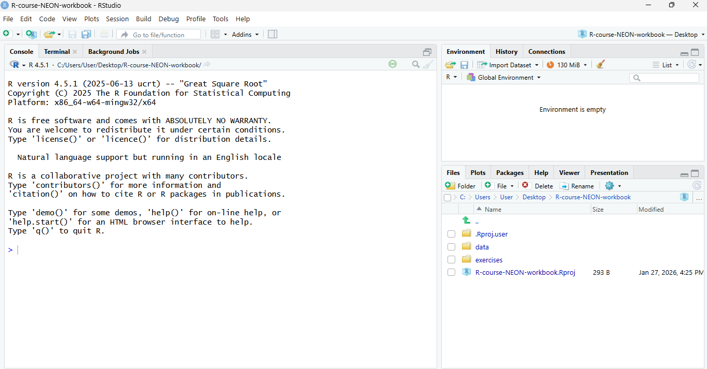

```{r, include = FALSE, purl = FALSE}
# Functions and data
source("src/setup.R")

# get chapter number based on name
chp_num <- get_chpNum("chp-computer-navigation", type = "fileName")
chp_str <- ifelse(nchar(chp_num) > 1, chp_num, paste0("0", chp_num))

# knitr options
source("src/knit-options.R")
knitr_fig_path(paste0(chp_str, "-"))

# Silently load in the data for this lesson
gapminder <- read.csv("data/gapminder_data.csv", header = TRUE)

# Silently set seed for random number generation, so we don't have to explain it
set.seed(10)
```

# Chapter `r chp_num`. `r get_chpName(chp_num, type.to = "nameLong")` {.tabset}

## Overview 

### What we will learn

In this lesson 
`r get_LO(as.numeric(chp_num), LOtable, prefix = TRUE)`

### Motivator - FIXME

Science is a multi-step process: once you've designed an experiment and collected
data, the real fun begins! This lesson will teach you how to start this process using
R and RStudio. We will begin with raw data, perform exploratory analyses, and learn
how to plot results graphically. This example starts with a dataset from
[gapminder.org](https://www.gapminder.org) containing population information for many
countries through time. Can you read the data into R? Can you plot the population for
Senegal? Can you calculate the average income for countries on the continent of Asia?
By the end of these lessons you will be able to do things like plot the populations
for all of these countries in under a minute!


- Why R?
  - R has a wide user community and will always be free
  - user contributed packages:
      -NEONUtilities
  - R and RStudio make it easy for anyone to reproduce your scientific analyses because your analyses are saved as code scripts rather than clicking through a graphical user interface
  - It is (relatively) easy to get help with (almost) anything

- R can:
  - do computations
  - manipulate data
  - access files on your computer or the internet
  - make graphs
  - create documents
  - create apps
  - almost anything... though it is not always the best tool for every job.

### Get set up
Please ensure you have the latest version of R and RStudio installed on your machine. This is important, as some packages used in the workshop may not install correctly (or at all) if R is not up to date. 
For instructions on installing (or updating) R and RStudio, please see [Computer Setup](computer-setup.html).

Once R and RStudio are installed, you will also need to set up the Student Workbook that accompanies this text as an RStudio project. Instructions are in the first exercise from [`r get_chpName("chp-computer-navigation", type.from = "fileName")`](chp-computer-navigation.html)


## Lesson

### Welcome (back) to RStudio!

- R is a programming language
- RStudio is an IDE
- Already learned about Console and Files windows
- Lot's of other windows that show additional functionality (such as version control (see addt lesson, application building and creating documents)
- In this lesson we will introduce the code, environment, packages and help windows.

We're going to learn some of the fundamentals of
the R language as well as some best practices for organizing code for
scientific projects that will make your life easier. We'll be using RStudio: a free, open-source R Integrated Development Environment (IDE).
It provides a built-in editor, works on all platforms (including
on servers) and provides many advantages such as integration with version
control and project management.

Let's start by opening the student workbook RStudio project that accompanies this text.
To open an RStudio project, use your computer's file browser
to the R-course-NEON folder you saved. Then double click on the R-course-NEON.Rproj file
(see the lesson:[`r get_chpName("chp-computer-navigation", type.from = "fileName")`](chp-computer-navigation.html)) 

**Basic layout**

When you first open RStudio, you will be greeted by three panels:

  * The interactive R console/Terminal (entire left)
  * Environment/History/Connections (tabbed in upper right)
  * Files/Plots/Packages/Help/Viewer (tabbed in lower right)

If you opened the R-course-NEON project then your RStudio session should look like this:



We're going to start working in the R console to learn about some of
the basic functionality of R. Once we start learning more complex
code, we will introduce the Source panel and create an R script
for saving the code that we write.

### What can R do?

Almost anything though it is not always the best tool for every job. The simplest thing it can do is calculations...

Much of your time in R will be spent in the R interactive
console. This is where you will run all of your code, and can be a
useful environment to try out ideas before adding them to an R script
file. This console in RStudio is the same as the one you would get if
you typed in `R` in your command-line environment.

The first thing you will see in the R interactive session is a bunch
of information, followed by a ">" and a blinking cursor. In many ways
this is similar to the shell environment you learned about during the
shell lessons: it operates on the same idea of a "Read, evaluate,
print loop": you type in commands, R tries to execute them, and then
returns a result.

#### Math

2	6	use the console for mathematical calculations	learners will
2	1	execute simple mathematical calculations	use R and RStudio to

The simplest thing you could do with R is to do arithmetic:

```{r}
1 + 100
```

And R will print out the answer, with a preceding "[1]". [1] is the index of 
the first element of the line being printed in the console. For more information 
on indexing vectors, see [Episode 6: Subsetting Data](https://swcarpentry.github.io/r-novice-gapminder/06-data-subsetting/index.html).

If you type in an incomplete command, R will wait for you to
complete it. If you are familiar with Unix Shell's bash, you may recognize this  
behavior from bash.

~~~
> 1 +
~~~
{: .r}

~~~
+
~~~
{: .output}

Any time you hit return and the R session shows a "+" instead of a ">", it
means it's waiting for you to complete the command. If you want to cancel
a command you can hit <kbd>Esc</kbd> and RStudio will give you back the ">" prompt.

> ## Tip: Canceling commands
>
> If you're using R from the command line instead of from within RStudio,
> you need to use <kbd>Ctrl</kbd>+<kbd>C</kbd> instead of <kbd>Esc</kbd>
> to cancel the command. This applies to Mac users as well!
>
> Canceling a command isn't only useful for killing incomplete commands:
> you can also use it to tell R to stop running code (for example if it's
> taking much longer than you expect), or to get rid of the code you're
> currently writing.
>
{: .callout}

When using R as a calculator, the order of operations is the same as you
would have learned back in school.

From highest to lowest precedence:

 * Parentheses: `(`, `)`
 * Exponents: `^` or `**`
 * Multiply: `*`
 * Divide: `/`
 * Add: `+`
 * Subtract: `-`

```{r}
3 + 5 * 2
```

Use parentheses to group operations in order to force the order of
evaluation if it differs from the default, or to make clear what you
intend.

```{r}
(3 + 5) * 2
```

This can get unwieldy when not needed, but clarifies your intentions.
Remember that others may later read your code.

```{r, eval=FALSE}
(3 + (5 * (2 ^ 2))) # hard to read
3 + 5 * 2 ^ 2       # clear, if you remember the rules
3 + 5 * (2 ^ 2)     # if you forget some rules, this might help
```


The text after each line of code is called a
"comment". Anything that follows after the hash (or octothorpe) symbol
`#` is ignored by R when it executes code.

Really small or large numbers get a scientific notation:

```{r}
2/10000
```

Which is shorthand for "multiplied by `10^XX`". So `2e-4`
is shorthand for `2 * 10^(-4)`.

You can write numbers in scientific notation too:

```{r}
5e3  # Note the lack of minus here
```

### Mathematical functions

R has many built in mathematical functions. To call a function,
we can type its name, followed by open and closing parentheses.
Functions take arguments as inputs, anything we type inside the parentheses of a function is considered an argument. Depending on the function, the number of arguments can vary from none to multiple. For example:

```{r, eval=FALSE}
getwd() #returns an absolute filepath
```

doesn't require an argument, whereas for the next set of mathematical functions we will need to supply the function a value in order to compute the result.

```{r}
sin(1)  # trigonometry functions
```

```{r}
log(1)  # natural logarithm
```

```{r}
log10(10) # base-10 logarithm
```

```{r}
exp(0.5) # e^(1/2)
```


#### Work with saved objects in a computing environment

2	7	state the rules for assigning variables	learners will
2	8	work with vectors	learners will

2	2	assign and manipulate variables	use R and RStudio to
2	3	"assign, subset and manipulate data in a vector"	use R and RStudio to
2	4	execute vector algebra	use R and RStudio to

arrow up to prior command


We can store values in variables using the assignment operator `<-`, like this:

```{r}
x <- 1/40
```

Notice that assignment does not print a value. Instead, we stored it for later
in something called a **variable**. `x` now contains the **value** `0.025`:

```{r}
x
```

More precisely, the stored value is a *decimal approximation* of
this fraction called a [floating point number](http://en.wikipedia.org/wiki/Floating_point).

Look for the `Environment` tab in the top right panel of RStudio, and you will see that `x` and its value
have appeared. Our variable `x` can be used in place of a number in any calculation that expects a number:

```{r}
log(x)
```

Notice also that variables can be reassigned:

```{r}
x <- 100
```

`x` used to contain the value 0.025 and now it has the value 100.

Assignment values can contain the variable being assigned to:

```{r}
x <- x + 1 #notice how RStudio updates its description of x on the top right tab
y <- x * 2
```

The right hand side of the assignment can be any valid R expression.
The right hand side is *fully evaluated* before the assignment occurs.

Variable names can contain letters, numbers, underscores and periods but no spaces. They
must start with a letter or a period followed by a letter (they cannot start with a number nor an underscore).
Variables beginning with a period are hidden variables.
Different people use different conventions for long variable names, these include

  * periods.between.words
  * underscores\_between_words
  * camelCaseToSeparateWords

What you use is up to you, but **be consistent**.

It is also possible to use the `=` operator for assignment:

```{r}
x = 1/40
```

But this is much less common among R users.  The most important thing is to
**be consistent** with the operator you use. There are occasionally places
where it is less confusing to use `<-` than `=`, and it is the most common
symbol used in the community. So the recommendation is to use `<-`.

> ## Challenge 1
>
> Which of the following are valid R variable names?
> ```{r, eval=FALSE}
> min_height
> max.height
> _age
> .mass
> MaxLength
> min-length
> 2widths
> celsius2kelvin
> ```
>
> > ## Solution to challenge 1
> >
> > The following can be used as R variables:
> > ```{r ch1pt1-sol, eval=FALSE}
> > min_height
> > max.height
> > MaxLength
> > celsius2kelvin
> > ```
> >
> > The following creates a hidden variable:
> > ```{r ch1pt2-sol, eval=FALSE}
> > .mass
> > ```
> >
> > The following will not be able to be used to create a variable
> > ```{r ch1pt3-sol, eval=FALSE}
> > _age
> > min-length
> > 2widths
> > ```
> {: .solution}
{: .challenge}


### Managing your environment 

There are a few useful commands you can use to interact with the R session.

`ls` will list all of the variables and functions stored in the global environment
(your working R session):

```{r}
ls()
```

> ## Tip: hidden objects
>
> Like in the shell, `ls` will hide any variables or functions starting
> with a "." by default. To list all objects, type `ls(all.names=TRUE)`
> instead
>
{: .callout}

Note here that we didn't give any arguments to `ls`, but we still
needed to give the parentheses to tell R to call the function.

If we type `ls` by itself, R prints a bunch of code instead of a listing of objects.

```{r}
ls
```

What's going on here?

Like everything in R, `ls` is the name of an object, and entering the name of
an object by itself prints the contents of the object. The object `x` that we
created earlier contains `r x`:

```{r}
x
```

The object `ls` contains the R code that makes the `ls` function work! We'll talk
more about how functions work and start writing our own later.

You can use `rm` to delete objects you no longer need:

```{r, eval=FALSE}
rm(x)
```

If you have lots of things in your environment and want to delete all of them,
you can pass the results of `ls` to the `rm` function:

```{r, eval=FALSE}
rm(list = ls())
```

In this case we've combined the two. Like the order of operations, anything
inside the innermost parentheses is evaluated first, and so on.

In this case we've specified that the results of `ls` should be used for the
`list` argument in `rm`. When assigning values to arguments by name, you *must*
use the `=` operator!!

If instead we use `<-`, there will be unintended side effects, or you may get an error message:

```{r, error=TRUE}
rm(list <- ls())
```

> ## Tip: Warnings vs. Errors
>
> Pay attention when R does something unexpected! Errors, like above,
> are thrown when R cannot proceed with a calculation. Warnings on the
> other hand usually mean that the function has run, but it probably
> hasn't worked as expected.
>
> In both cases, the message that R prints out usually give you clues
> how to fix a problem.
>


Notice that although rm() and ls() are similar to the shell commands rm and ls, they operate in different spaces. The Terminal window in RStudio accesses the file system on your computer. The R Console accesses objects that you create during a specific R session. Once your close R, these objects disappear forever; they are not saved on your file system.


#### Reading data from files

2	5	read and view tabular data from a file	learners will

2	7	read a data table from a file	use R and RStudio to

tab complete


#### Getting help

2	9	learn how to get help and troubleshoot error messages	learners will
2	8	access and understand a function's documentation page	use R and RStudio to


Don't worry about trying to remember every function in R. You
can look them up on Google, or if you can remember the
start of the function's name, use the tab completion in RStudio.

This is one advantage that RStudio has over R on its own, it
has auto-completion abilities that allow you to more easily
look up functions, their arguments, and the values that they
take.

Typing a `?` before the name of a command will open the help page
for that command. When using RStudio, this will open the 'Help' pane;
if using R in the terminal, the help page will open in your browser.
The help page will include a detailed description of the command and
how it works. Scrolling to the bottom of the help page will usually
show a collection of code examples which illustrate command usage.
We'll go through an example later.


R, and every package, provide help files for functions. The general syntax to search for help on any
function, "function_name", from a specific function that is in a package loaded into your
namespace (your interactive R session) is:

```{r, eval=FALSE}
?function_name
help(function_name)
```

For example take a look at the help file for `write.table()`, we will be using a similar function in an upcoming episode. 

```{r, eval=FALSE}
?write.table()
```

This will load up a help page in RStudio (or as plain text in R itself).

Each help page is broken down into sections:

 - Description: An extended description of what the function does.
 - Usage: The arguments of the function and their default values (which can be changed).
 - Arguments: An explanation of the data each argument is expecting.
 - Details: Any important details to be aware of.
 - Value: The data the function returns.
 - See Also: Any related functions you might find useful.
 - Examples: Some examples for how to use the function.

Different functions might have different sections, but these are the main ones you should be aware of. 

Notice how related functions might call for the same help file: 

```{r, eval=FALSE}
?write.table()
?write.csv()
```

This is because these functions have very similar applicability and often share the same arguments as inputs to the function, so package authors often choose to document them together in a single help file.

> ## Tip: Running Examples
>
> From within the function help page, you can highlight code in the 
> Examples and hit <kbd>Ctrl</kbd>+<kbd>Return</kbd> to run it in 
> RStudio console. This gives you a quick way to get a feel for
> how a function works.
{: .callout}

> ## Tip: Reading Help Files
>
> One of the most daunting aspects of R is the large number of functions
> available. It would be prohibitive, if not impossible to remember the
> correct usage for every function you use. Luckily, using the help files
> means you don't have to remember that!
{: .callout}

### Special Operators

To seek help on special operators, use quotes or backticks:

```{r, eval=FALSE}
?"<-"
?`<-`
```

### Getting Help with Packages

Many packages come with "vignettes": tutorials and extended example documentation.
Without any arguments, `vignette()` will list all vignettes for all installed packages;
`vignette(package="package-name")` will list all available vignettes for
`package-name`, and `vignette("vignette-name")` will open the specified vignette.

If a package doesn't have any vignettes, you can usually find help by typing
`help("package-name")`.

RStudio also has a set of excellent
[cheatsheets](https://rstudio.com/resources/cheatsheets/) for many packages.


### When You Remember Part of the Function Name

If you're not sure what package a function is in or how it's specifically spelled, you can do a fuzzy search:

```{r, eval=FALSE}
??function_name
```

A fuzzy search is when you search for an approximate string match. For example, you may remember that the function 
to set your working directory includes "set" in its name. You can do a fuzzy search to help you identify the function:

```{r, eval=FALSE}
??set
```

### When You Have No Idea Where to Begin

If you don't know what function or package you need to use
[CRAN Task Views](http://cran.at.r-project.org/web/views)
is a specially maintained list of packages grouped into
fields. This can be a good starting point.

### When Your Code Doesn't Work: Seeking Help from Your Peers

If you're having trouble using a function, 9 times out of 10,
the answers you seek have already been answered on
[Stack Overflow](http://stackoverflow.com/). You can search using
the `[r]` tag. Please make sure to see their page on 
[how to ask a good question.](https://stackoverflow.com/help/how-to-ask)

If you can't find the answer, there are a few useful functions to
help you ask your peers:

```{r, eval=FALSE}
?dput
```

Will dump the data you're working with into a format that can
be copied and pasted by others into their own R session.

```{r}
sessionInfo()
```

Will print out your current version of R, as well as any packages you
have loaded. This can be useful for others to help reproduce and debug
your issue.

> ## Challenge 1
>
> Look at the help page for the `c` function. What kind of vector do you
> expect will be created if you evaluate the following:
> ```{r, eval=FALSE}
> c(1, 2, 3)
> c('d', 'e', 'f')
> c(1, 2, 'f')
> ```
> > ## Solution to Challenge 1
> >
> > The `c()` function creates a vector, in which all elements are of the
> > same type. In the first case, the elements are numeric, in the
> > second, they are characters, and in the third they are also characters:
> > the numeric values are "coerced" to be characters.
> {: .solution}
{: .challenge}

> ## Challenge 2
>
> Look at the help for the `paste` function. You will need to use it later.
> What's the difference between the `sep` and `collapse` arguments?
>
> > ## Solution to Challenge 2
> >
> > To look at the help for the `paste()` function, use:
> > ```{r, eval=FALSE}
> > help("paste")
> > ?paste
> > ```
> > The difference between `sep` and `collapse` is a little
> > tricky. The `paste` function accepts any number of arguments, each of which
> > can be a vector of any length. The `sep` argument specifies the string
> > used between concatenated terms — by default, a space. The result is a
> > vector as long as the longest argument supplied to `paste`. In contrast,
> > `collapse` specifies that after concatenation the elements are *collapsed*
> > together using the given separator, the result being a single string. 
> >
> > It is important to call the arguments explicitly by typing out the argument 
> > name e.g `sep = ","` so the function understands to use the "," as a 
> > separator and not a term to concatenate.
> > e.g. 
> > ```{r} 
> > paste(c("a","b"), "c")
> > paste(c("a","b"), "c", ",")
> > paste(c("a","b"), "c", sep = ",")
> > paste(c("a","b"), "c", collapse = "|")
> > paste(c("a","b"), "c", sep = ",", collapse = "|")
> > ```
> > (For more information,
> > scroll to the bottom of the `?paste` help page and look at the
> > examples, or try `example('paste')`.)
> {: .solution}
{: .challenge}

> ## Challenge 3
> Use help to find a function (and its associated parameters) that you could
> use to load data from a tabular file in which columns are delimited with "\t"
> (tab) and the decimal point is a "." (period). This check for decimal
> separator is important, especially if you are working with international
> colleagues, because different countries have different conventions for the
> decimal point (i.e. comma vs period).
> Hint: use `??"read table"` to look up functions related to reading in tabular data.
> 
> > ## Solution to Challenge 3
> >
> > The standard R function for reading tab-delimited files with a period
> > decimal separator is read.delim(). You can also do this with
> > `read.table(file, sep="\t")` (the period is the *default* decimal
> > separator for `read.table()`), although you may have to change
> > the `comment.char` argument as well if your data file contains
> > hash (#) characters.
> {: .solution}
{: .challenge}


### Installing and loading packages

"base" R is the functionality that comes installed with R, but the powerfull thing about R is its user community who have created thousands of "packages" that increase its functionality.

2	3	install and load packages in R	learners will

It is possible to add functions to R by writing a package, or by
obtaining a package written by someone else. As of this writing, there
are over 10,000 packages available on CRAN (the comprehensive R archive
network). R and RStudio have functionality for managing packages:

* You can see what packages are installed by typing
  `installed.packages()`
* You can install packages by typing `install.packages("packagename")`,
  where `packagename` is the package name, in quotes.
* You can update installed packages by typing `update.packages()`
* You can remove a package with `remove.packages("packagename")`
* You can make a package available for use with `library(packagename)`

Packages can also be viewed, loaded, and detached in the Packages tab of the lower right panel in RStudio. Clicking on this tab will display all of the installed packages with a checkbox next to them. If the box next to a package name is checked, the package is loaded and if it is empty, the package is not loaded. Click an empty box to load that package and click a checked box to detach that package.

Packages can be installed and updated from the Package tab with the Install and Update buttons at the top of the tab.

> ## Challenge 5
>
> Install the following packages: `ggplot2`, `plyr`, `gapminder`
>
> > ## Solution to challenge 5
> >
> > We can use the `install.packages()` command to install the required packages.
> > ```{r ch5-sol, eval=FALSE}
> > install.packages("ggplot2")
> > install.packages("plyr")
> > install.packages("gapminder")
> > ```
> >
> > An alternate solution, to install multiple packages with a single `install.packages()` command is:
> > ```{r ch5-sol2, eval=FALSE}
> > install.packages(c("ggplot2", "plyr", "gapminder"))
> > ```
> {: .solution}
{: .challenge}


### Writing code in scripts
  - R and RStudio make it easy for anyone to reproduce your scientific analyses because your analyses are saved as code scripts rather than clicking through a graphical user interface

2	4	write and save a code script in a project folder	learners will

2	5	write and save a code script	use R and RStudio to
2	6	write comments in a code script	use R and RStudio to


Once you open files, such as R scripts, an editor panel will also open
in the top left.


> ## R scripts
> 
> Any commands that you write in the R console can be saved in to a file
> to be re-run again.  Files containing R code to be ran in this way are 
> called R scripts.  R scripts have `.R` at the end of their names to 
> let you know what they are.
{: .callout}

::: {.challenge}
> #### Try this: Create and save a new R script
>
>
>
:::

### Workflow within RStudio
There are two main ways one can work within RStudio:

1. Test and play within the interactive R console then copy code into
a .R file to run later.
   *  This works well when doing small tests and initially starting off.
   *  It quickly becomes laborious
2. Start writing in a .R file and use RStudio's short cut keys for the Run command
to push the current line, selected lines or modified lines to the
interactive R console.
   * This is a great way to start; all your code is saved for later
   * You will be able to run the file you create from within RStudio
   or using R's `source()`  function.

> #### Tip: Running segments of your code
>
> RStudio offers you great flexibility in running code from within the editor
> window. There are buttons, menu choices, and keyboard shortcuts. To run the
> current line, you can
> 1. click on the `Run` button above the editor panel, or
> 2. select "Run Lines" from the "Code" menu, or
> 3. hit <kbd>Ctrl</kbd>+<kbd>Return</kbd> in Windows or Linux
> or <kbd>&#8984;</kbd>+<kbd>Return</kbd> on OS X.
> (This shortcut can also be seen by hovering
> the mouse over the button). To run a block of code, select it and then `Run`.
> If you have modified a line of code within a block of code you have just run,
> there is no need to reselect the section and `Run`, you can use the next button
> along, `Re-run the previous region`. This will run the previous code block
> including the modifications you have made.

::: {.challenge}
> #### Try this: Open and run an R script
>
> Open this script.
> Run it line by line and point out the part of the R script from the prior section (e.g. read a table, assign a variable, etc)
> Run the who thing.
> Close it and use source() to run it from the file.
>
:::


## Exercises

After completing these exercises, learners will be able to 
`r get_LO(as.numeric(chp_num), CStable, prefix = TRUE, bullet = "1.")`

2	1	execute simple mathematical calculations	use R and RStudio to
2	2	assign and manipulate variables	use R and RStudio to
2	3	"assign, subset and manipulate data in a vector"	use R and RStudio to
2	4	execute vector algebra	use R and RStudio to
2	5	write and save a code script	use R and RStudio to
2	6	write comments in a code script	use R and RStudio to
2	7	read a data table from a file	use R and RStudio to
2	8	access and understand a function's documentation page	use R and RStudio to

Number all exercises using the module number. Include starter code in the /exercises folder if appropriate.

`r chp_num`.1 

`r chp_num`.2 


> ## Challenge 2
>
> What will be the value of each variable  after each
> statement in the following program?
>
> ```{r, eval=FALSE}
> mass <- 47.5
> age <- 122
> mass <- mass * 2.3
> age <- age - 20
> ```
>
> > ## Solution to challenge 2
> >
> > ```{r ch2pt1-sol}
> > mass <- 47.5
> > ```
> > This will give a value of `r mass` for the variable mass
> >
> > ```{r ch2pt2-sol}
> > age <- 122
> > ```
> > This will give a value of `r age` for the variable age
> >
> > ```{r ch2pt3-sol}
> > mass <- mass * 2.3
> > ```
> > This will multiply the existing value of `r mass/2.3` by 2.3 to give a new value of
> > `r mass` to the variable mass.
> >
> > ```{r ch2pt4-sol}
> > age <- age - 20
> > ```
> > This will subtract 20 from the existing value of `r age + 20 ` to give a new value
> > of `r age` to the variable age.
> {: .solution}
{: .challenge}


> ## Challenge 4
>
> Clean up your working environment by deleting the mass and age
> variables.
>
> > ## Solution to challenge 4
> >
> > We can use the `rm` command to accomplish this task
> > ```{r ch4-sol}
> > rm(age, mass)
> > ```
> {: .solution}
{: .challenge}


## Sources and Resources

This lesson was adapted from [@swc-reproducible-lesson](https://swcarpentry.github.io/r-novice-gapminder/) episodes 1 and 3 by Jes Coyle.

This lesson utilizes data from @NEON-soilCO2 and @NEON-soiltemp.

### Additional Resources

* [#RYouWithMe: Basic Basics Lesson 1: An Opinionated Tour of RStudio](https://www.youtube.com/watch?v=kfcX5DEMAp4)
* [Quick R](http://www.statmethods.net/)
* [RStudio cheat sheets](http://www.rstudio.com/resources/cheatsheets/)
* [Cookbook for R](http://www.cookbook-r.com/)

### Cited References

