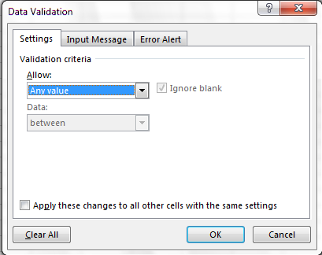
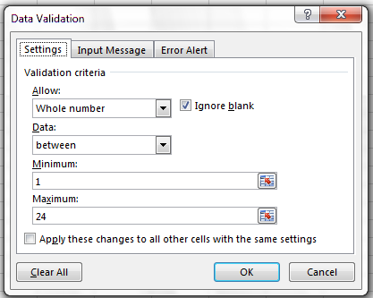

```{r, include = FALSE, purl = FALSE}
# Functions and data
source("src/setup.R")

# get chapter number based on name
.chp <- "spreadsheets"
.chp_num <- .get_chpNum("chp-spreadsheets", type = "fileName")
.chp_str <- ifelse(nchar(.chp_num) > 1, .chp_num, paste0("0", .chp_num))

# knitr options
source("src/knit-options.R")
.knitr_fig_path(paste0(.chp_str, "-"))


# Silently set seed for random number generation, so we don't have to explain it
set.seed(10)
```

# Chapter `r .chp_num`. `r .get_chpName(.chp_num, type.to = "nameLong")` {.tabset}


## Overview 

> Good data organization is the foundation of a research
project. Developing good habits from the start will save you A LOT of time later.

Most researchers have data or do data entry in
spreadsheets. Spreadsheet programs are very useful graphical
interfaces for designing data tables and handling very basic data
quality control functions.

This lesson will  teach you how to think about data organization and some practices for more effective data wrangling. Not only will this save time and effort, it also makes your work more accessible provides wider avenues for collaboration and improvement!


### What we will learn

In this lesson 
`r .get_LO("spreadsheets", .LOtable, prefix = TRUE)`

#### Key Terms & Commands

* raw data
* derived data
* metadata
* header
* missing data
* null value


### Prerequisites

Many spreadsheet programs are available. Since most organizations utilize Excel as their primary spreadsheet program, this lesson will make use of Excel examples. Free spreadsheet programs that can also be used are LibreOffice Calc, and even Google Sheets. Commands may differ a bit between programs, but the general idea is the same. We recommend using Excel to follow along in this lesson.

In this lesson you will also need a plain text editor that can show whitespace characters (e.g. spaces and tabs). Some options include: [Notepad++](https://notepad-plus-plus.org/){target="_blank"} (Windows), [Zed](https://zed.dev/){target="_blank"} (Mac, Linux), [Sublime](https://www.sublimetext.com/){target="_blank"} (Mac, Linux, Windows), and [BBEdit](https://www.barebones.com/products/bbedit/){target="_blank"} (Mac). Mac comes with [TextEdit](https://support.apple.com/guide/textedit/welcome/mac){target="_blank"} and Windows comes with [Notepad](https://apps.microsoft.com/detail/9msmlrh6lzf3?hl=en-US&gl=US){target="_blank"} pre-installed. These simple text editors work fine for writing basic text files, but they lack some of the functionality we will need to examine data more closely.

This lesson uses the [Portal Project Teaching Dataset](https://figshare.com/articles/dataset/Portal_Project_Teaching_Database/1314459) (@Ernest2020). 
The data are observations of a small mammal community in southern Arizona. This is a real dataset that has been simplified  a little bit for this lesson. 

Before you begin this lesson, download the data by clicking [here](https://ndownloader.figshare.com/files/2252083). Save this file to the data folder in your R-course-NEON-workbook folder.

We depart from using NEON data for this lesson because the data provided by NEON are already cleaned and follow best practices for data organization. We will revisit NEON data in the exercises that accompany this lesson.


## Lesson

### What good are spreadsheets?

Spreadsheets encompass a lot of the things we need
to be able to do as researchers. We can use them for:

- Data entry
- Organizing data
- Subsetting and sorting data
- Statistics
- Plotting and generating tables

Spreadsheets are good for data entry, but in reality we tend to
use spreadsheet programs for much more than data entry, even when a
spreadscheet program is not the best tool for the job.

Generating tables for reports in a spreadsheet is not
optimal - often, when formatting a data table, we're
reporting key summary statistics in a way that is not really meant to
be read as data, and often involves special formatting
(merging cells, creating borders, making it pretty). Cutting and pasting from a spreadsheet
to a document software (like Word) can have unpredictable results.
We advise you to create tables within document software
using the document's own table editing software.

You should also use caution when calculating statistics and creating figures 
in spreadsheet software. Because of the graphical, drag and drop nature of
spreadsheet programs, it can be very difficult, if not impossible, to
replicate your steps (much less retrace anyone else's), particularly if your
stats or figures require you to do more complex calculations. Furthermore,
in doing calculations in a spreadsheet, it's easy to accidentally apply a
slightly different formula to multiple adjacent cells. When using a
command-line based statistics program like R, it's practically
impossible to apply a calculation to one observation in your
dataset but not another unless you're doing it on purpose.

Our recommendation: **Only use spreadsheet software to enter, clean up and organize data.** Save the data analysis for other programs. This will make your research more **reproducible**.


### Keeping track of your analyses

When you're working with spreadsheets, during data clean up or analyses, it's
very easy to end up with a spreadsheet that looks very different from the one
you started with. In order to be able to reproduce your analyses or figure out
what you did be sure to follow these key steps:

**1. Never change the raw data.**

**Raw data** are the data that you collect during a research study. These are the original data that you would enter into a spreadsheet. Once the data are entered, it is a good idea to treat the data as "read-only". This means that if you modify the data and need to work with it, save it as a new data table (see step 2). Don't modify the original data set, or you will never know where you started!


**2. Create new derived data files for analyses.**

Once you are ready to analyze your data, create a copy of the raw data before you make any changes. Save this new **derived data** table with a descriptive name.


**3. Write down the data cleaning and analysis steps in a separate file.**

Keep track of the steps you took in your data clean up or analysis. Think of this as an electronic lab notebook: you should track these steps as you would any step in an experiment. We recommend that you do this in a **plain text file** (.txt) stored in the same folder as the data file. Write the notes using a text editor  (see Prerequisites on the Overview tab) rather than word processing software (e.g. Microsoft Word or Google Docs).

Make sure to describe what you did to create any of the derived data tables.

This might be an example of a spreadsheet setup:

{alt='spreadsheet setup'}

Put these principles in to practice today as you work through this lesson.


### Metadata

**Metadata** are "data about data". Metadata tell the user what each data file contains and how the data were collected. There are several standard formats for metadata and going into these is beyond the scope of this lesson.
The most important feature of a metadata file is that it allows anyone to confidently use your data. Therefore, at a minimum, a meta data file must contain:

1. The publisher or author of the data (and how to contact them).
2. A description of what is in the data file and how the data were collected.
3. A description of any abbreviations or variable names in the data. That is, what do the headings on the columns mean?
4. Where the data originally come from. For example, if downloaded from an online source, there should be an appropriate citation, website and download date.

If data are being shared with others, then a metadata file should also contain information about how the data can be used. Are they under copyright? Are they free to re-use and re-distribute (e.g. see the [Creative Commons licences](https://creativecommons.org/licenses/){target="_blank"} for examples).

Many data publishers include a text-based `README.txt` or `METADATA.txt` file with the data that contains all of this information. Get in the habit of writing your own metadata file when you create your own original data files. If you are using data downloaded from the internet, be sure to save the metadata files in the same location that you save the data so that you can easily find them later.

If data consist of multiple files (e.g. an original raw data file and subsequent derived data files), the metadata files should document all of the files in the data set, describe their content and format, and describe the organizing principles of folders and subfolders. For each of the separate files listed, it is a good idea to document the manipulations or analyses that were carried out on those data. [Cornell University's Research Data Management Service Group](https://data.research.cornell.edu/content/readme){target="_blank"} provides detailed guidelines for how to write a good README file, along with an adaptable template.


### Structure of "tidy" data tables

The cardinal rule of using spreadsheet programs for data is to keep it "tidy":

1. **Put each variables in its own column.** Variables are the thing you're measuring, like 'weight' or 'temperature'.
2. **The names of the variables belong in the top row.** This is called the **header**.
3. **Put each observation in its own row.** Observations are the objects you are studying (e.g. individual animals, study sites, etc.) 
4. **Rows must be exchangeable.** The order of the rows shouldn't matter for understanding the data. If the observations are in a particular order for a reason, record this reason in a column (e.g. a column named "time").
5. **Don't combine multiple pieces of information in one cell.** Sometimes it just seems like one thing, but consider whether that's the only way you'll want to be able to use or sort that data.
6. **Use text for all data.** Don't use formatting to convey important information.
7. **Save data in a text-based format** like tab-delimited or comma-delimited (CSV) format. This ensures that anyone can use the data with any computer program. The default format of spreadsheet software is usually not text based (e.g. Excel defaults to .xlsx files which are not text-based and must be read by special programs).


Following these rules will make it easy for a computer program (like R) to read your data. Text-based files are  **machine-readable** and also easily human-readable. This makes it easy for other researchers to understand and re-use your data. See [@Browman-Woo-2018](https://doi.org/10.1080/00031305.2017.1375989) for additional guidance on these best practices.


In this lesson we'll work through the recommendations for tidy data using data from a survey of small mammals in a desert ecosystem. Different people have gone to the field and entered data into a spreadsheet (and made several mistakes!). Before this lesson you should have downloaded the Portal Project Teaching data set to your computer in a file named `survey_data_spreadsheet_messy.xls`. 

Open this file in Excel or any spreadsheet software. You can see that there are two tabs. Two field assistants conducted the surveys, one in 2013 and one in 2014, and they both kept track of the data in their own way in tabs `2013` and `2014` of the dataset, respectively. Now you're the person in charge of this project and you want to be able to  start analyzing the data.

Let's see if you can identify each of the above problems in data table organization. As we identify each error, correct it and record the steps that you took to "clean" the data in a separate text file. You can open a new text file for this using a text editor (see Prerequisites on the Overview tab).


:::{.callout-important}

Do not forget our first piece of advice: create a new file (or tab) for the cleaned data, never
modify your original (raw) data. Before you get started, save a copy of the original data and rename it as `survey_data_spreadsheet_cleaned.xls`.

:::

To get started, examine the data found in all three tabs of `survey_data_spreadsheet_messy.xls`. 

:::{.challenge}

What are the observations in these data? What should one row represent?

<details><summary>**Solution:**</summary>
::: {.solution}

Observations are individual small mammals. Each row should represent one individual captured on a plot on a particular date.
:::

</details>
:::

<br>

:::{.challenge}

What are the variables in these data? What columns should we include?

<details><summary>**Solution:**</summary>
::: {.solution}

* Year
* Date Collected
* Plot
* Sex
* Weight
* Species
* Notes

Why Notes? Did you notice the "scale not calibrated" message? We should keep this information with the data, but it doesn't belong in the Weight column.

:::

</details>
:::

<br> 

Let's set up a blank tidy data table where we can reorganize these data. Create a new tab in this workbook by clicking on the plus at the bottom of the window. Give it an informative name, such as "cleaned". Then created a **header row** in row 1 with the names of the variables that we need to record.


### Common problems in data table organization

There are a few potential errors to be on the lookout for in your own data as well as data from collaborators or the Internet. If you are aware of the errors and the possible negative effect on downstream data analysis and result interpretation, it might motivate you to try and avoid them. Making small changes to the way you format your data in spreadsheets can have a great impact on efficiency and reliability when it comes to data cleaning and analysis.

- [Using multiple tables](#tables)
- [Using multiple tabs](#tabs)
- [Not filling in zeros](#zeros)
- [Using problematic null values](#null)
- [Using formatting to convey information](#formatting)
- [Using formatting to make the data sheet look pretty](#formatting-pretty)
- [Placing comments or units in cells](#units)
- [Entering more than one piece of information in a cell](#info)
- [Using problematic field names](#field-name)
- [Using special characters in data](#special)
- [Inclusion of metadata in data table](#metadata-bullet)
- [Date formatting](03-dates-as-data.md)


#### Using multiple tables {#tables}

A common strategy is creating multiple data tables within
one spreadsheet. This confuses the computer, so don't do this!
When you create multiple tables within one
spreadsheet, you're drawing false associations between things for the computer,
which sees each row as an observation. You're also potentially using the same
field name in multiple places, which will make it harder to clean your data up
into a usable form. The example below depicts the problem:

{alt='multiple tabs'}

In the example above, the computer will see (for example) row 4 and assume that all columns A-AF
refer to the same sample. This row actually represents four distinct samples
(sample 1 for each of four different collection dates - May 29th, June 12th, June 19th, and June 26th),
as well as some calculated summary statistics (an average (avr) and standard error of measurement (SEM)) for two of those samples. Other rows are similarly problematic.

#### Using multiple tabs {#tabs}

But what about workbook tabs? That seems like an easy way to organize data, right? Well, yes and no. When you create extra tabs, you fail to allow the computer to see connections in the data that are there (you have to introduce spreadsheet application-specific functions or scripting to ensure this connection). Say, for instance, you make a separate tab for each day you take a measurement.

This isn't good practice for two reasons:

1) You are more likely to accidentally add inconsistencies to your data if each time you take a measurement, you start recording data in a new tab.
2) Even if you manage to prevent all inconsistencies from creeping in, you will add an extra step for yourself before you analyze the   data because you will have to combine these data into a single datatable. You will have to explicitly tell the computer how to combine tabs - and if the tabs are inconsistently formatted, you might even have to do it manually.

The next time you're entering data, and you go to create another tab or table, ask yourself if you could avoid adding this tab by adding another column to your original spreadsheet. We used multiple tabs in our example of a messy data file, but now you've seen how you can reorganize your data to consolidate across tabs.

Your data sheet might get very long over the course of the experiment. This makes it harder to enter data if you can't see your headers at the top of the spreadsheet. But don't repeat your header row. These can easily get mixed into the data, leading to problems down the road.

Instead you can freeze the column headers so that they remain visible even when you have a spreadsheet with many rows.

[Documentation on how to freeze column headers in MS Excel](https://support.office.com/en-ca/article/Freeze-column-headings-for-easy-scrolling-57ccce0c-cf85-4725-9579-c5d13106ca6a)

#### Not filling in zeros {#zeros}

It might be that when you're measuring something, it's
usually a zero, say the number of times a rabbit
is observed in the survey. Why bother
writing in the number zero in that column, when it's mostly zeros?

However, there's a difference between a zero and a blank cell in a spreadsheet. To the computer, a zero is actually data. You measured
or counted it. A blank cell means that it wasn't measured and the computer will interpret it as an unknown value (otherwise known as a
null value).

The spreadsheets or statistical programs will likely mis-interpret blank cells that you intend to be zeros. By not entering the value of
your observation, you are telling your computer to represent that data as unknown or missing (null). This can cause problems with
subsequent calculations or analyses. For example, the average of a set of numbers which includes a single null value is always null
(because the computer can't guess the value of the missing observations). Because of this, it's very important to record zeros as zeros and truly missing data as nulls.

#### Using problematic null values {#null}

**Example**:  using -999, other numerical values, zero, or text to represent missing values.
Whatever the reason, it's a problem if unknown or missing data is recorded as -999, 999, or 0.
Many statistical programs will not recognize that these are intended to represent missing (null) values.

How these values are interpreted will depend on the software you use to analyze your data.

**Solutions**:

A solution will depend on the final application of your data and how you intend to analyze it,
but it is essential to use a clearly defined and CONSISTENT null indicator. Blank cells are the best choices for most applications;
when working in R, `NA` may be an acceptable null value choice.

There are a many reasons why null values get represented differently within a dataset.
Sometimes confusing null values are automatically recorded from the measuring device. If that's the case, there's not much you can do, but it can be addressed in data cleaning with a tool like [OpenRefine](https://www.datacarpentry.org/OpenRefine-ecology-lesson/){target="_blank"} before analyzing or sharing. In other cases, null values are used to convey different reasons why the data is missing. This is important information to capture, but is actually using one column to capture two pieces of information. Like for [using formatting to convey information](#formatting) it would be good here to create a new column like 'data\_missing' and use that column to capture the different reasons.

Whatever the reason, missing data is a problem. It is essential to use a clearly defined and consistent null indicator.
Blanks (most applications) and NA (for R) are good choices. @white_et_al_2013 explain good choices for indicating null values for different software applications in their article:
[Nine simple ways to make it easier to (re)use your data.](https://doi.org/10.4033/iee.2013.6b.6.f){target="_blank"}.


#### Using formatting to convey information {#formatting}

**Example**: highlighting cells, rows or columns that should be excluded from an analysis, leaving blank rows to indicate separations in data.

{alt='formatting'}

**Solution**: create a new field to encode which data should be excluded.

{alt='good formatting'}

#### Using formatting to make the data sheet look pretty {#formatting-pretty}

**Example**: merging cells.

**Solution**: If you're not careful, formatting a worksheet to be more aesthetically pleasing can compromise your computer's ability to
see associations in the data. Merged cells will make your data unreadable by statistics software. Consider restructuring your data in
such a way that you will not need to merge cells to organize your data.

#### Placing comments or units in cells {#units}

**Example**: Your data was collected, in part, by a summer student who you later found out was mis-identifying some of your species, some
of the time. You want a way to note these data are suspect.

**Solution**: Most analysis software can't see Excel or LibreOffice comments, and would be confused by comments placed within your data
cells. As described above for formatting, create another field if you need to add notes to cells. Similarly, don't include units in
cells: ideally, all the measurements you place in one column should be in the same unit, but if for some reason they aren't, create
another field and specify the units the cell is in.

#### Entering more than one piece of information in a cell {#info}

**Example**: Does this table follow the tidy data recommendations? What problem might occur if you want to use these data?

{alt='multiple-info example'}

Variables are in columns and observations are in rows, but two different pieces of information are saved in the same columns (Species and Sex). This would make it difficult to sort these data just by species or just by sex.

**Solution:** Don't include more than one piece of information in a cell. This will limit the ways in which you can analyze your data. Here is a better way to organize these data:

{alt='single-info example'}

#### Using problematic field names {#field-name}

Choose descriptive field names, but be careful not to include spaces, numbers, or special characters of any kind. Spaces can be
misinterpreted by parsers that use whitespace as delimiters and some programs don't like field names that are text strings that start
with numbers.

Underscores (`_`) are a good alternative to spaces. Consider writing names in camel case (like this: ExampleFileName) to improve
readability. Remember that abbreviations that make sense at the moment may not be so obvious in 6 months, but don't overdo it with names
that are excessively long. Including the units in the field names avoids confusion and enables others to readily interpret your fields.

:::{.challenge}

For each example below, what is the problem with the name in the Avoid column? Is the name in the Good Name column better than the Good Alternative? If so, why?

| Good Name | Good Alternative | Avoid |
|:---------:|:----------------:|:-----:|
| Max_temp_C | MaxTemp | Maximum Temp (°C) |
| Precipitation_mm | Precipitation | precmm |
| Mean_year_growth | MeanYearGrowth | Mean growth |
| sex | sex | M/F |
| mass_g | weight | w. |
| Observation_01 | first_observation | 1st observation |
| Good_data | Keep | Keep data? |


:::


#### Using special characters in data {#special}

**Example**: You treat your spreadsheet program as a word processor when writing notes, for example copying data directly from Word or
other applications.

**Solution**: This is a common strategy. For example, when writing longer text in a cell, people often include line breaks, em-dashes,
etc in their spreadsheet.  Also, when copying data in from applications such as Word, formatting and fancy non-standard characters (such
as left- and right-aligned quotation marks) are included.  When exporting this data into a coding/statistical environment or into a
relational database, dangerous things may occur, such as lines being cut in half and encoding errors being thrown.

General best practice is to avoid adding characters such as newlines, tabs, and vertical tabs.  In other words, treat a text cell as if
it were a simple web form that can only contain text and spaces.  

#### Inclusion of metadata in data table {#metadata-bullet}

**Example**: You add a legend at the top or bottom of your data table explaining column meaning, units, exceptions, etc.

**Solution**: Recording data about your data ("metadata") is essential. You may be on intimate terms with your dataset while you are
collecting and analysing it, but the chances that you will still remember that the variable "sglmemgp" means single member of group, for
example, or the exact algorithm you used to transform a variable or create a derived one, after a few months, a year, or more are slim.

As well, there are many reasons other people may want to examine or use your data - to understand your findings, to verify your findings,
to review your submitted publication, to replicate your results, to design a similar study, or even to archive your data for access and
re-use by others. While digital data by definition are machine-readable, understanding their meaning is a job for human beings. The
importance of documenting your data during the collection and analysis phase of your research cannot be overestimated, especially if your
research is going to be part of the scholarly record.

However, metadata should not be contained in the data file itself. Unlike a table in a paper or a supplemental file, metadata (in the
form of legends) should not be included in a data file since this information is not data, and including it can disrupt how computer
programs interpret your data file. Rather, metadata should be stored as a separate file in the same directory as your data file,
preferably in plain text format with a name that clearly associates it with your data file. Because metadata files are free text format,
they also allow you to encode comments, units, information about how null values are encoded, etc. that are important to document but can
disrupt the formatting of your data file.

Additionally, file or database level metadata describes how files that make up the dataset relate to each other; what format are they are
in; and whether they supercede or are superceded by previous files. A folder-level readme.txt file is the classic way of accounting for
all the files and folders in a project.


### Dates

Dates in spreadsheets can be a problem. For one thing, dates are stored typically in a single column. While this seems the most natural way to record dates, it actually is not best practice. A spreadsheet application will display the dates in a seemingly correct way (to a human observer) but how it actually handles and stores the dates may be problematic.

In particular, DATE functions that are valid for a given spreadsheet program (be it LibreOffice Calc, Microsoft Excel, OpenOffice, Gnumeric, etc.) are usually guaranteed to be compatible only within the same family of products. Regardless of your spreadsheet, if you will later need to export the data, you are better off handling them using one of the solutions discussed below.

One of the big problems with Excel is it can [turn things that aren't dates into dates](https://nsaunders.wordpress.com/2012/10/22/gene-name-errors-and-excel-lessons-not-learned/){target="_blank"}, for example gene/protein names or identifiers like MAR1, DEC1, OCT4 will be changed to dates, and you cannot retrieve the
original name or identifier (except manually). So if you avoid the date format overall, it's easier to work with these types of data. When you must work with dates, here is how to do it efficiently.

:::{.callout-important}
When working with dates and time, **don't use the date format** intrinsic to your spreadsheet program. Be sure that dates and times are saved in a text or numeric format.
:::

#### Date formats in spreadsheets

Spreadsheet programs have numerous "useful features" which allow them to handle dates in a variety of ways.

{alt="Many date formats, many ambiguities"}

But these "features" often allow ambiguity to creep into your data. Ideally, data should be as unambiguous as possible.

The main thing to know is that anything formatted as a date in Excel is actually stored as a number (see the last column in the above figure). Essentially, it counts the days from a default of December 31, 1899, and thus stores July 2, 2014 as  the serial number 41822. Times are handled in a similar way and are saved in the number of seconds. When exporting into a text-based format (such as CSV), Excel will export its internal date integer instead of a useful value (that is, the dates will be represented as integer numbers). This can potentially lead to problems if you use other software to manipulate the file. 

In the figure above, you'll see that there are many ways that ambiguity creeps into the data depending on the format you chose when you enter your data, and if you're not fully aware of which format you're using, you can end up actually entering your data in a way that Excel will badly misinterpret. You may end up with errors that will be extremely difficult to track down and troubleshoot.

:::{.challenge}
What happens to the dates in the `dates` tab of our workbook if we save this sheet in Excel (in `csv` format) and then open the file in a plain text editor (like TextEdit or Notepad)? What happens to the dates if we then open the `csv` file in Excel?

<details><summary>**Solution:**</summary>
::: {.solution}

1. Click to the `dates` tab of the workbook and double-click on any of the values in the `Date collected` column. Notice that the dates display with the year 2015.
2. Select `File -> Save As` in Excel and in the drop down menu for file format select `CSV UTF-8 (Comma delimited) (.csv)`. Click `Save`.
3. You will see a pop-up that says "This workbook cannot be saved in the selected file format because it contains multiple sheets." Choose `Save Active Sheet`.
4. Navigate to the file in your file browsers application. Right click and select `Open With`. Choose a plain text editor application and view the file. Notice that the dates display as month/day without any year information.
5. Now right click on the file again and open with Excel. Notice that the dates display with the current year, not 2015.  
  
As you can see, exporting data from Excel and then importing it back into Excel fundamentally changed the data once again!

:::

</details>
:::

<br> 


:::{.callout-tip}
Here's more reasons to always save dates as text and not use the dates format of your spreadsheet program.

Excel is unable to parse dates from before 1899-12-31, and will thus leave these untouched.  If you're mixing historic data from before and after this date, Excel will translate only the post-1900 dates into its internal format, thus resulting in mixed data. If you're working with historic data, be extremely careful with your dates!

Excel also entertains a second date system, the 1904 date system, as the default in Excel for Macintosh. This system will assign a different serial number than the [1900 date system](https://support.microsoft.com/en-us/help/214330/differences-between-the-1900-and-the-1904-date-system-in-excel){target="_blank"}. Because of this, [dates must be checked for accuracy when exporting data from Excel](https://uc3.cdlib.org/2014/04/09/abandon-all-hope-ye-who-enter-dates-in-excel/){target="_blank"} (look for dates that are ~4 years off).
:::

#### Text-based date formatting

It is much safer to store dates with YEAR, MONTH, DAY in separate columns or as YEAR and DAY-OF-YEAR in separate columns. Day of the year is 1 on Jan 1 and 365 on Dec. 31 (see this [calendar](https://www.esrl.noaa.gov/gmd/grad/neubrew/Calendar.jsp){target="_blank"} from NOAA). Either approach works well- choose the one that makes the most sense with how you want to analyze the data. 

If you absolutely must have the date in a single column, store it as text in an unambiguous format. The most standard format for dates and times is `YYYYMMDD` or `YYYY-MM-DD`, where `YYYY` is the four-digit year and `MM` and `DD` are two-digit representations of the month and day. For example, May 3rd, 2017 would be `2017-05-03`. Times can be saved as `HH:MM:SS`, where the hour is reported in the 24-hour clock (e.g. 1pm is 13). If you must put dates and times together in one column, use `YYYY-MM-DD HH:MM:SS` or `YYYYMMDDhhmmss`.

One benefit of following this format is that it allows date and time columns to be sorted in the correct order.


### Spreadsheet program quality control features

When you have a tidy data table, you can use several simple techniques within your spreadsheet to ensure the data you enter is free of errors. These approaches include techniques that are implemented prior to entering data (quality assurance) and techniques that are used after entering data to check for errors (quality control).

#### Quality Assurance

Quality assurance stops bad data from ever being entered by checking to see if values are valid during data entry. For example, if research is being conducted at sites A, B, and C, then the value V (which is right next to B on the
keyboard) should never be entered. Likewise if one of the kinds of data being collected is a count, only integers greater than or equal to zero should be allowed.

To control the kind of data entered into a spreadsheet we use Data Validation (Excel), to set the values that can be entered in each data column.

1\. Select the cells or column you want to validate

2\. On the `Data` tab select `Data Validation`

{alt='Image of Data Validation button on Data tab'}

3\. In the `Allow` box select the kind of data that should be in the column. Options include whole numbers, decimals, lists of items, dates, and other values.

{alt='Image of Data Validation window'}

4\. After selecting an item enter any additional details. For example, if you've chosen a list of values, enter a comma-delimited or semi-colon list of allowable values in the `Source` box.

Let's try this out by setting the plot column in our cleaned data spreadsheet to only allow
plot values that are integers between 1 and 24.

1. Select the `Plot` column.
2. On the `Data` tab select `Data Validation`
3. In the `Allow` box select `Whole number`
4. Set the minimum and maximum values to 1 and 24.

{alt='Image of Data Validation window for validating plot values'}

Now let's try entering a new value in the plot column that isn't a valid plot. The spreadsheet stops us from entering the wrong value and asks us if we would like to try again.

{alt='Image of error when trying to enter invalid data'}


Quality assurance can make data entry easier as well as more robust. For example, if you use a list of options to restrict data entry, the spreadsheet will provide you with a drop-downlist of the available items. So, instead of trying to remember how to spell *Dipodomys spectabilis*, you can select the right option from the list.

{alt='Image of drop-down menu'}

#### Quality Control

Once data are entered, you can use a spreadsheet to identify values that may be incorrect by sorting or filtering the data. Sorting data will arrange all of the rows in a table according to the values found in one or more columns. Filtering data will only show rows where the data match the values selected for specific columns (e.g. Sex is "M").

To sort or filter data in a spreadsheet:

1. Select all of the data in the table to ensure that all of the data in a given row stays together. A quick way to do this is to click on the small triangle in the uppper left corner of the spreadsheet (between A and 1).
2. Click on the Data tab.
3. Select Sort or Filter.
4. If you select Sort, a window will pop up asking which column you want to sort by and how to arrange the items (e.g. highest to lowest or lowest to highest). One way to QC your data is to sort by each column and quickly scan it from top to bottom for incorrect values.
5. If you select Filter the header row will change to have small drop-down arrows. If you click on an arrow you can select the values that should show up in the table. Scanning the list of values available can be a quick way to spot incorrect values.

:::{.callout-important}
If your dataset is well-structured and does not contain formulas, sorting should never affect the integrity of your dataset. If your data do contain formulas, you may run into trouble. Be sure to save a text-only copy of your raw data before performing and quality control operations (see [Data export](#dataexport) below).
:::

:::{.challenge}

We've combined all of the tables from the messy data into a single table in a single tab. Download this semi-cleaned data file to your computer: [survey\_sorting\_exercise](https://github.com/datacarpentry/spreadsheet-ecology-lesson/blob/gh-pages/data/survey_sorting_exercise.xlsx?raw=true)

Once downloaded, sort the `Weight_grams` column in your spreadsheet program from `Largest to Smallest`.

What do you notice?


<details><summary>**Solution:**</summary>
::: {.solution}

Click the Sort button on the data tab in Excel. A pop-up will appear. Make sure you select `Expand the selection`.

The following window will display, choose the column you want to sort as well as the sort order.


Notice how the incorrect values sort to the top and bottom of the tabular data.
The cells containing no data values sort to the bottom of the tabular data, while the cells where the letter "g" was included can be found towards the top. This is a powerful way to check your data for outliers and incorrect values.

{alt='quality\_control2, exercise1' .output}

{alt='quality\_control3, exercise1' .output}

:::

</details>
:::

<br>


### Data export from spreadsheet programs {#dataexport}

Storing the data you're going to work with for your analyses in Excel default file format (`*.xls` or `*.xlsx` - depending on the Excel version) isn't a good idea. Why?

- Because it is a proprietary format, and it is possible that in the future, technology won't exist (or will become sufficiently rare) to make it inconvenient, if not impossible, to open the file.

- Other spreadsheet software may not be able to open files saved in a proprietary Excel format.

- Different versions of Excel may handle data  differently, leading to inconsistencies.

- Finally, most data repositories don't  accept Excel format. It needs to be in one of the formats
  discussed below.

- The above points also apply to other formats such as open data formats used by LibreOffice / Open Office. These formats are not static and are not read the same way by different software packages.

As an example of inconsistencies in data storage, do you remember how we talked about how Excel stores dates earlier? It turns out that there are multiple defaults for different versions of the software, and you can switch between them all. So, say you're compiling Excel-stored data from multiple sources. There are dates in each file - Excel interprets them as their own internally consistent serial numbers. When you combine the data, Excel will take the serial number from the place you're importing it from, and interpret it using the rule set for the version of Excel you're using. Essentially, you could be adding errors to your data, and it wouldn't necessarily be flagged by any data cleaning methods if your ranges overlap.

Storing data in a universal, open, and static format will help deal with this problem. Try tab-delimited (tab separated values or TSV) or comma-delimited (comma separated values or CSV) formats. CSV files are plain text files where the columns are separated by commas, hence 'comma separated values' or CSV. The advantage of a CSV file over an Excel. file is that we can open and read a CSV file using just about any software, including plain text editors like TextEdit or NotePad. Data in a CSV file can also be easily imported into other formats and environments, such as R. We're not tied to a certain version of a certain expensive program when we work with CSV files, so it's a good format to work with for maximum portability and endurance. Most spreadsheet programs can save to delimited text formats like CSV easily, although they may give you a warning during the file export.

To save a file you have opened in Excel in CSV format:

1. From the top menu select 'File' and 'Save as'.
2. In the 'Format' field, from the list, select 'Comma Separated Values' (`*.csv`).
3. Double check the file name and the location where you want to save it and hit 'Save'.

{alt='Saving an Excel file to CSV'}

An important note for backwards compatibility: you can open CSV files in Excel!

1. Open Excel and click File > Open.
2. Navigate to the folder where the file is saved.
3. Select All Files *.*.
4. Click on the CSV file you wish to open. Excel will do the rest.


:::{.challenge}

What does a CSV file look like?

1. Follow the steps above to save your cleaned data table from this lesson as a new csv file in the `data/derived` directory of your R-course-NEON-workbook folder.
2. Use your file browser to navigate to the location where you saved this file.
3. Open the file with a text editor, such as Notepad (Windows) or TextEdit (Mac). You can do this by right-clicking on the files and selecting "Open With" (you may need to click "Choose another application").

You can also see the actual contents of a text-based data file using RStudio:

1. Use the File window in RStudio to navigate to the folder where the CSV file is saved.
2. Click on the name of the CSV file then select `View file`.
3. A new tab will open in the Source window.

:::


#### A Note on Cross-platform Operability

Text files have a special line-ending character that tell the computer where a line ends. 
By default, most coding and statistical environments expect UNIX-style line endings (ASCII `LF` character) as representing line breaks.  However, Windows uses an alternate line ending signifier (ASCII `CR LF` characters) by default.

As such, when exporting to CSV using Excel, your data in text format will look like this:

`data1,data2<CR><LF>1,2<CR><LF>4,5<CR><LF>`

When opening your CSV file in Excel again, it will parse it as follows:


{alt='Example of line endings parsed in Excel'}

However, if you open your CSV file on a different system that does not understand the `CR` character it will interpret your CSV file differently. You may then see a weird character or possibly the string `CR` or `\r`:

{alt='Another example of line endings parsed in Excel'}

Note that this happens on Excel for OSX as well as Windows. When exporting from Excel, be sure to save as a "Windows comma separated (.csv)" file.


#### Caveats on commas

In some datasets, the data values themselves may include commas (,). This is particularly true in countries that use commas as decimal separators. In that case, the software which you use (including Excel) will most likely incorrectly display the data in columns. This is because the commas which are a part of the data values will be interpreted as column delimiters.

If you are working with data that contains commas, you likely will need to use another delimiter when working in a spreadsheet. In this case, consider using tabs as your delimiter and working with tab delimited files. Tab delimited files can be exported from spreadsheet programs in the same way as CSV files.

::: {.callout-tip}

When working with text based data files it can be helpful to use a more powerful text editor, such as [Notepad++](https://notepad-plus-plus.org/) or [BBEdit](https://www.barebones.com/products/bbedit/). Using one of these editors will allow you to see whitespace characters such as tabs `\t` and line ending characters `LF`, which can be really handy when you need to troubleshoot problems with data formatting.

:::


## Exercises

After completing these exercises, learners will be able to 
`r .get_LO(.chp, .CStable, prefix = TRUE, bullet = "1.")`


**`r .chp_num`.1** 

1. Submit the cleaned text-based data file `survey_data_spreadsheet_cleaned.csv` that you created while working through this lesson.
2. Submit a text file documenting the steps you took to created the derived data file `survey_data_spreadsheet_cleaned.csv`. Name this text file `r .chp_num`.1.txt.

**`r .chp_num`.2** 

1. Open the file `exercises/3.2_data.csv` in Excel or another spreadsheet program.
2. Perform a quality control analysis on the data to identify any potentially missing data, outlier data or inconsistencies in the way categorical data were recorded. Keep track of and fix the errors that you find.
3. List 3 ways that these data do not adhere to best practices in tidy data table formatting. How would you improve this?
4. List 3 ways that these data do adhere to best practices in tidy data table formatting.
5. What should be included in a metadata file that accompanies these data?


## Sources and Resources

This lesson was adapted from [@swc-reproducible-lesson](https://swcarpentry.github.io/r-novice-gapminder/) episode 2 and [@dc-spreadsheet-lesson](https://datacarpentry.org/spreadsheet-ecology-lesson/) by Jes Coyle.

Text on metadata adapted from the online course Research Data [MANTRA](https://datalib.edina.ac.uk/mantra) by EDINA and Data Library, University of Edinburgh. MANTRA is licensed under a [Creative Commons Attribution 4.0 International License](https://creativecommons.org/licenses/by/4.0/).


### Cited References

::: {#refs}
:::
