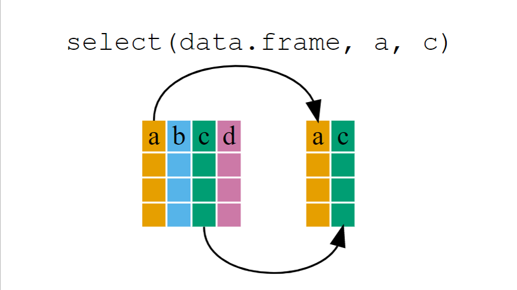
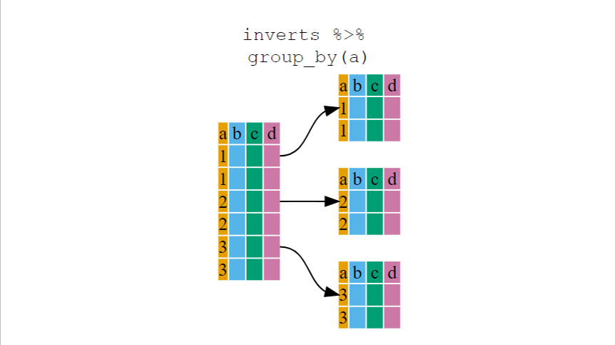
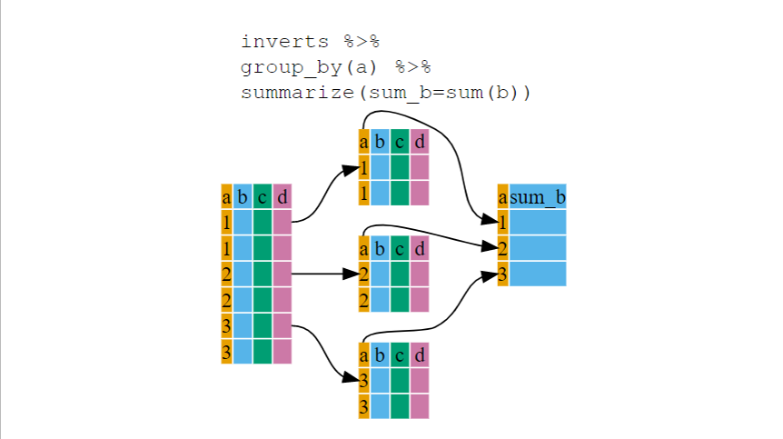

```{r, include = FALSE, purl = FALSE}
# Functions and data
getwd()
source("src/setup.R")

# get chapter number based on name
.chp <- "tidyverse-basics"
.chp_num <- .get_chpNum("chp-tidyverse-basics", type = "fileName")
.chp_str <- ifelse(nchar(.chp_num) > 1, .chp_num, paste0("0", .chp_num))

# knitr options
source("src/knit-options.R")
.knitr_fig_path(paste0(.chp_str, "-"))

# Silently set seed for random number generation, so we don't have to explain it
set.seed(10)

# Load ggplot2
library("ggplot2")

# Set theme options
# ggplot theme options
theme_set(theme_gray(base_size = 30))
update_geom_defaults("point", aes(size = 3))


```

# Chapter `r .chp_num`. `r .get_chpName(.chp_num, type.to = "nameLong")` {.tabset}

## Overview 

> How are organisms affected by their environment? Answering this question requires connecting data of different types from different sources and measured at different spatial and temporal scales. Before any statistical analysis can begin, scientists need the ability to manipulate data tables in a reproducible way.

Manipulation of data tables can mean many things; we often select certain observations (rows) or variables (columns), we often group the data by a certain variable(s), or we even calculate summary statistics. Base R has functions for most kinds of data table manipulation, but the methods are sometimes idiosyncratic and difficult to learn.

Enter the [`tidyverse`](https://www.tidyverse.org/), a set of packages designed to work together and follow general rules of data science. We have already met one [core package](https://www.tidyverse.org/packages/#core-tidyverse) in this universe- [`ggplot2`](https://ggplot2.tidyverse.org/) and another for working with dates- [`lubridate`](https://lubridate.tidyverse.org/). In this lesson we will meet two more: [`dplyr`](https://dplyr.tidyverse.org/), a package for manipulating and summarizing data within one table and [`tidyr`](https://tidyr.tidyverse.org/), a package for reformatting and combining data tables.


### What we will learn

In this lesson 
`r .get_LO(.chp, .LOtable, prefix = TRUE)`

#### Key Terms & Commands

* split-apply-combine operations
* pipes (`%>%`)
* outer vs. inner joins
* `select()`
* `filter()`
* `group_by()`
* `summarize()`
* `mutate()`
* `left_join()`, `right_join()`, `full_join()`, `inner_join()`
* `pivot_wider()`and `pivot_longer()`
* `rename()`
* `count()`
* `arrange()` and `desc()`


### Prerequisites

Before beginning this lesson you should have completed the lesson [`r .get_chpName("ggplot2-part1", type.from = "chp")`](chp-ggplot2-part1.html) and any prerequisites therein. We will also use parts of [`r .get_chpName("program-flow", type.from = "chp")`](chp-program-flow.html).

Before you begin:

1. Open the R-course-NEON-workbook RStudio project.
2. Create a new R script named `r paste0("lesson_", .chp_str, "_code.R")` in the lesson-code folder of the student workbook.
3. Whenever you see R code like this:

```{r eval = FALSE}
Type (or copy) this into your R script. Then run it in the Console.

```

4. Whenever you see a challenge like this:

:::{.challenge}

Try to solve the problem by writing R code into your script. Check your answer by clicking:

<details><summary>**Solution:**</summary>

::: {.solution}

```{r eval = FALSE}
The code that solves the challenge will appear here.
```

Along with an explanation.

:::

</details>

:::

<br>


4. Be sure to click **Save** often to save your work.


## Lesson

In this lesson we will be working on an analysis of macroinvertebrate diversity at three NEON aquatic sites: Caribou Creek, Alaska (CARI), Martha Creek, Washington (MART), and Teakettle Creek, California (TECR). You can see a map of these sites on the [NEON website](https://www.neonscience.org/field-sites/explore-field-sites). Our goal is to evaluate which site has the highest summer macroinvertebrate diversity and determine whether macroinvertebrate abundance is related to water temperature over the course of the summer.


Just like in the lesson [`r .get_chpName("program-flow", type.from = "chp")`](chp-program-flow.html), we are going to download and work with data from NEON aquatic sites:  However in this lesson we will be working with macroinvertebrate collections ([DP1.20120.001](https://data.neonscience.org/data-products/DP1.20120.001)) in addition to surface water temperature data ([DP1.20053.001](https://data.neonscience.org/data-products/DP1.20053.001)). 

We will download data from NEON using the `loadByProduct()` function in the `neonUtilities` package. We need to specify the product ID number, sites and dates for which we want data and then type `y` when prompted to download the data at the command line.

```{r eval = FALSE}
library(neonUtilities)

# Define dates for download: June 1 - Oct 31, 2021
# but we need to start before June 1 to get the entire month of June
startdate <- "2021-05-31"
enddate <- "2021-10-31"

# Define the sites to download 
# TECR = Teakettle Creek,  MART = Martha Creek, CARI = Caribou Creek
sites <- c("TECR", "MART", "CARI") 

# Macroinvertebrate observations
inverts_list <- loadByProduct(dpID = "DP1.20120.001",
                               site = sites,
                               startdate = startdate,
                               enddate = enddate)

# Temperature in surface water
watertemp_list <- loadByProduct(dpID = "DP1.20053.001",
                               site = sites,
                               startdate = startdate,
                               enddate = enddate)


```
```{r include = FALSE, message = FALSE}
# Load neonUtilities package
library(neonUtilities)

# Load previously downloaded object
#save(watertemp_list, inverts_list, file = "src/chp-tidyverse_datasets.RData")
load("src/chp-tidyverse_datasets.RData")
```

You should now have a two new objects named `inverts_list` and `watertemp_list` in the Environment panel. `watertemp_list` is the same object we downloaded in lesson [`r .get_chpName("program-flow", type.from = "chp")`](chp-program-flow.html). Let's extract the data frame that contains 30-minute temperature averages from it.

```{r}
# Extract 30 min temperature averages 
# and save as a separate data frame
TSW_30min <- watertemp_list$TSW_30min

```

`inverts_list` should be a list with nine elements. To learn what these objects contain we should read the NEON User Guide to Aquatic Macroinvertebrate Collection on the [NEON Documentation page](https://data.neonscience.org/data-products/DP1.20120.001) for these data. From this guide we can learn some key information about the way these data are collected and reported. The three sites we are using are considered "wadeable streams". According to the documentation, macroinvertebrate samples at these sites represent a patch of stream bottom near the midpoint of the stream reach (between the two upstream and downstream automated water samplers). However there may be up to two different habitats sampled if the stream is not homogenous. There are three sampling bouts each season: 

|  "Sample bout 1 is an early‐season date, representing a period of rapid biomass accumulation after winter, typically prior to leaf out or ice‐off where applicable. Sample bout 2 targets mid‐summer baseflow conditions and sample bout 3 represents the late growing season (typically autumn) during leaf‐fall where applicable." 

Each sample is sent to an expert taxonomy lab, where the samples are sorted into 1 mm size classes and then and identified to the lowest taxonomic rank possible (usually Genus or species). These identifications are standardized by NEON and then reported in the `inv_taxonomyProcessed`, which contains counts of each taxon in each size class. The documentation notes that...
|  "In some cases, the taxonomy lab reported counts from the same size class twice, and numbers should be summed. This is indicated in the field `sizeCategory`, where the `sizeClass` is appended with a, b, c, etc. Depending on the use case, data users may want to sum all `sizeClass` and `sizeCategory` per `sampleID` + `scientificName` prior to data analysis."

Therefore, each `sampleID` record in the `inv_fieldData` table can correspond to multiple records in `inv_taxonomyProcessed` table, which contains one record for each `scientificName` and size‐class combination.

Since we are interested in estimating abundance, we should also be aware that, according to the documentation, "Count data can be found in the field `estimatedTotalCount`, which is corrected for subsampling at the external lab, but is NOT corrected for benthic area. Data users will need to refer to the `benthicArea` presented in the `inv_fieldData` table and apply this correction to get the number of organisms per square meter of stream, lake, or river bottom. All taxon records from a sample should be summed and divided by the `benthicArea` prior to reporting the total abundance per m^2.

From this information we learn that we will need two of the objects in the `inverts_list` to complete our analysis:

* `inv_fieldData` contains data on when and where the invertebrate samples were collected
* `inv_taxonomyProcessed` contains taxonomic information about which taxa were collected in each sample

Quality control information is included in the `inv_persample` data frame, but we won't be using this in this lesson.

Let's extract each of these data frames from the downloaded list objects into separate data frame objects.

```{r}
# Extract invertebrate collections
inv_fieldData <- inverts_list$inv_fieldData

# Extract taxonomic information
inv_taxa <- inverts_list$inv_taxonomyProcessed

```


Now we have a three data frames. Click on each one in the Environment panel to see what they contain:

* `inv_fieldData` includes the dates and locations where invertebrates were sampled at each site. Each row is a particular sampling event.
* `inv_taxa` includes the invertebrate taxa that were found in each sample. Each row is a particular taxon in a particular sampling event.
* `TWS_30min` includes water temperature data from upstream and downstream sensors at each site. Each row contains average sensor data during a 30 minute time period.


### The `dplyr` package: data frame manipulation

The [`dplyr`](https://dplyr.tidyverse.org/) package provides a number of very useful functions for manipulating data frames in a way that will reduce repetition, reduce the probability of making errors, and probably even save you some typing. As an added bonus, you might even find the `dplyr` grammar easier to read.

Here we're going to cover 5 of the most commonly used functions and demonstrate how to use pipes (`%>%`) to combine them.

1. `select()`
2. `filter()`
3. `group_by()`
4. `summarize()`
5. `mutate()`

We're going to demonstrate how to use these functions with the `inv_taxa` data frame. 

If you have have not installed this package earlier, please do so:

```{r, eval=FALSE}
install.packages('dplyr')
```

Now let's load the package:

```{r warning=FALSE}
library("dplyr")
```

You likely saw several messages about objects being "masked" when you loaded this packages. This means that the package contains functions that have the same names as functions in base R or other packages that you already loaded. When you call one of those function, R will assume you want the version from the package you loaded more recently, in this case, `dplyr`.


#### Use **`select()`** to extract columns

The `inv_taxa` data frame contain a lot of columns! Let's create a new data frame just with a few of the columns that we want to work with. The `select()` function will keep only the variables indicated.

Note that the first argument in `select()` is a `.data` arguments, which takes the name of the data frame we want to operate on. After the name of the dataframe, we can write the name of each column to keep. These column names are **not** quoted. As in any function, arguments can be broken across lines, so long as there is a comma at the end of each line.


```{r}
inverts <- select(inv_taxa, siteID, sampleID, 
                  scientificName, taxonRank, phylum, class, order, family, genus,
                  sizeClass, estimatedTotalCount)
```

{width=50%}

If we want to remove columns we can use a minus sign (`-`) in front of the column name.

```{r}
inverts_notaxa <- select(inverts, -phylum, -class, -order, -family, -genus)
```

In the Environment panel, click on `inverts` and `inverts_notaxa` to compare the columns present in these data frames.

Above we used 'normal' grammar, but the strengths of `dplyr` lie in combining several functions using **pipes**. In computer programming , a pipe composes functions; it takes the output of the first function and passes it to the first input in the second function.

Since the pipes grammar is unlike anything we've seen in R before, let's repeat what we've done above using pipes.

```{r}
inverts <- inv_taxa %>% select(siteID, sampleID, scientificName, 
                               taxonRank, phylum, class, order, family, genus,
                               sizeClass, estimatedTotalCount)
```

To help you understand why we wrote that in that way, let's walk through it step by step. First we summon the `inv_taxa` data frame and pass it on, using the pipe symbol `%>%`, to the next function, `select()`. If you open the help file for `select()` (type `?select` into the Console), you will see that the first argument in `select()` is `.data` which takes a data frame. Therefore, we don't need to specify a data object inside the `select()` function because it received that from the previous pipe. 


#### Use **`filter()`** to subset rows

Suppose the next step in our analysis is to restrict our analysis to only insects. Insects are in the class Insecta. Previously we learned that we could subset the rows of a data frame using the base R function `subset()`.

```{r}
insects <- subset(inverts, class == "Insecta")
```

Here's how to do the same operation using `filter()` from the `dplyr` package.

```{r}
insects <- inverts %>% filter(class == "Insecta")
```

Or, if we don't need the intermediate `inverts` data frame, we could have performed both operations at once using a pipe:

```{r}
insects <- inv_taxa %>%
  select(siteID, sampleID, scientificName, 
         taxonRank, phylum, class, order, family, genus,
         sizeClass, estimatedTotalCount) %>%
    filter(class == "Insecta")
```

Notice that for these two functions, the order in which we do them doesn't matter. We could have written:

```{r}
insects <- inv_taxa %>%
  filter(class == "Insecta") %>%
  select(siteID, sampleID, scientificName, 
         taxonRank, order, family, genus,
         sizeClass, estimatedTotalCount)
    
```

Actually- writing the operations in this order means that we no longer need the columns for phylum and class, since `insects` should all belong to the same order, Insecta.

The `filter()` function can be used with multiple filters, each provided as an argument and separated by commas:

```{r}
insects_big_MART <- inverts %>%
  filter(class == "Insecta", sizeClass >= 4, siteID == "MART") %>%
  select(-siteID, -phylum, -class)
```

::: {.challenge}

What do you think the code above did? Check your guess by clicking on the `insects` object in the Environment panel.

<details><summary>**Solution:**</summary>

::: {.solution}

`insects_big_MART` was filtered from the `inverts` data frame and now contains all observations of insectes where specimens were at least 4 mm long and came from samples collected at the Martha Creek NEON site ("MART"). It contains all columns that were in `inverts` except for `siteID`, `phylum` and `class`.

:::

</details>

:::

<br>

:::{.callout-important}
The first argument in any `dplyr` function that can manipulate data is a `.data` argument that takes a data frame. This is why the pipe (`%>%`) works to compose `dplyr` functions together- it is passing the output of one function (a data frame) to the first argument of the next function, which is always `.data`.

Thus, a pipe will work with any function whose first argument takes a data frame. This includes `ggplot()` and functions in the `tidyr` package, which we will learn about later in this lesson.

:::


::: {.challenge}

Write a single command (which can span multiple lines and includes pipes) that takes `inv_taxa` as an input and will produce a four-column data frame showing the abundance  of different size classes of Arachnid taxa from samples collected at the Caribou Creek NEON site ("CARI"). The four columns in the output should be: `sampleID`,`scientificName`, `sizeClass`, `estimatedTotalCount`. You will need to use the `siteID` and `class` columns in the filtering step.


<details><summary>**Solution:**</summary>

::: {.solution}

```{r}
arachnids_CARI <- inv_taxa %>%
  filter(class == "Arachnida", siteID == "CARI") %>%
  select(sampleID, scientificName, sizeClass, estimatedTotalCount)
```

**Note:** The order of operations is very important in this case. If we used `select()` first, `filter()` would not be able to find the variables `class` or `siteID` because we would have removed it in the previous step.

:::

</details>

:::

<br>

::: {.callout-trick}

When working in a script in RStudio, you can use tab-completion inside the `select()` and `filter()` functions to choose columns in the dataframe, so long as the preceeding code specifies a data source.

For example, if you have typed the following
```{r eval = FALSE}
inv_taxa %>%
  filter(


```

pressing <kbd>tab</kbd> when your cursor is inside the open parentheses will bring up a list of all of the columns in `inv_taxa` that you can select from.

:::


#### Use **`group_by()`** and **`summarize()`** to perform operations within groups

Suppose we want to count the number of individuals of each invertebrate taxon found in each sample. We know that some taxa can occur in multiple size classes- for example, let's look at the mayfly taxon *Afghanurus sp.* found at the Martha Creek site:

```{r}
inverts %>% 
  filter(siteID == "MART", scientificName == "Afghanurus sp.") %>%
  select(sampleID, scientificName, sizeClass, estimatedTotalCount)

```

We can see that two size classes were recorded during the `MART.20210728.HESS.6` sampling event- one individual in the 4 mm size class and one individual in the 5 mm size class. If we want a table that summarizes the total abundance of each taxon regardless of size class, then we would need to add these two counts together.

We can do this using  `group_by()` and `summarize()`.

The `group_by()` function is used to divide a data frame into subsets based on a set of criteria.

Here is the structure of a regular data frame:
```{r}
str(inverts)

```

Here is the structure of a grouped data frame:
```{r}
str(inverts %>% group_by(siteID))
```
You will notice that the structure of the data frame where we used `group_by()` is called a `grouped_df` and is not quite the same as the original `inverts` (a `data.frame`). A `grouped_df` can be thought of as a `list` where each item in the `list`is a `data.frame` which contains only the rows that correspond to a particular
value in the `siteID` column (at least in the example above). You can see this at the bottom of the output above showing the groups attribute (`-attr(*, "groups")`) is based on the `siteID` column which is divided into three groups of `.rows`.

{width=50%}

Combining `group_by()` with `summarize()` will allow us split the `inverts` data frame into multiple pieces, then run functions on each piece separately (e.g. `mean()` or `sum()`). The output will bring the summaries back together into a single data frame. 

```{r}
# Calculate the total abundance of all inverts sampled at each site
inverts_bysite <- inverts %>%
    group_by(siteID) %>%
    summarize(total = sum(estimatedTotalCount))

inverts_bysite
```

{width=50%}

That allowed us to calculate the total number of individuals from samples at each site, but what if we want the total calculated for each taxon in each sample?

The function `group_by()` allows us to group by multiple variables. Let's group by `siteID` and `sampleID`.


```{r message = FALSE}
inverts_bysample <- inverts %>%
    group_by(siteID, sampleID) %>%
    summarize(total = sum(estimatedTotalCount))

inverts_bysample
```

Now we have the total abundance across all taxa within each sample, but by keeping `siteID` in the `group_by()` function, it is also returned in the output.

::: {.challenge}

Use `group_by()` and `summarize()` to calculate the total number of individuals in each taxon (`scientificName`) in each sample.

<details><summary>**Solution:**</summary>

::: {.solution}

```{r message = FALSE}
inverts_bytaxa <- inverts %>%
    group_by(siteID, sampleID, scientificName) %>%
    summarize(total = sum(estimatedTotalCount))

```

Click on `inverts_bytaxa` in the Environment panel to verify that this worked. You should see a four column data frame with `r nrow(inverts_bytaxa)` rows.

NOTE: You don't need to include `siteID` in the `group_by()` function because this information is already encoded in the `sampleID` column. However, doing so will make it easier to see which samples come from each site when we use this data frame later in the analysis.

:::

</details>

:::

<br>

That is already quite powerful, but it gets even better! You're not limited to defining 1 new variable in `summarize()`. You can include as many summary statistics as you wish. Remember that each calculation is performed within the subsets defined by `group_by()`.

Let's calculate a the mean length of individuals in each taxon and sample using a weighted average where we multiple the size class by the number of individuals in each size class, then divide by the total number of individuals. 

For example, what if we want 

```{r echo = FALSE, message = FALSE}
inverts %>% 
  filter(siteID == "MART", scientificName == "Afghanurus sp.") %>%
  select(sampleID, scientificName, sizeClass, estimatedTotalCount) %>%
  arrange(sampleID, sizeClass)

```

to show the following:

```{r echo = FALSE}
inverts %>% 
  filter(siteID == "MART", scientificName == "Afghanurus sp.") %>%
  select(sampleID, scientificName, sizeClass, estimatedTotalCount) %>%
  arrange(sampleID, sizeClass) %>%
  group_by(scientificName, sampleID) %>%
  summarize(total = sum(estimatedTotalCount),
            size_mean = sum(sizeClass*estimatedTotalCount)/total)
```

To calculate this weighted average, we should take the sum of the product of the `sizeClass` and `estimatedTotalCount` columns, then divide by the total number of individuals.

```{r message = FALSE}
inverts_bytaxa <- inverts %>%
    group_by(siteID, sampleID, scientificName) %>%
    summarize(total = sum(estimatedTotalCount),
            size_mean = sum(sizeClass*estimatedTotalCount)/total)

# view the first 10 rows
inverts_bytaxa[1:10, ]

```

Notice that when calculating `mean_size` we were able to refer to the `total` column that was already calculated for each group, rather than needing to repeat the `sum(estimatedTotalCount)` operation.


The **"split-apply-combine"** functionality of `group_by()` and `summarize()` can also be implemented in base R and other packages (see `plyr` and `purrr` if interested), but the functions used in base R are not as consistent and easy to understand (e.g. `*apply()`, `by()`, `aggregate()`). Thus, we will stick to `dplyr` for these lessons. Interested readers can check out additional resources in the references section of this lesson.

::: {.challenge}

Calculate the mean, minimum and maximum surface water temperature at each site in the `TSW_30min` data frame, but only using good data where `finalQF == 0`.

HINT: Think about the steps you need to take and how these can be accomplished using the `dplyr` functions you have learned so far. Try to write each step separately first, then link them together with pipes.


<details><summary>**Solution:**</summary>

::: {.solution}

Here is one way to solve the problem with each step as a separate line of code:

```{r}
# Filter the temperature data to good observations
TSW_30min_good <- filter(TSW_30min, finalQF == 0)

# Group the good data by site then summarize by calculating 
# mean, minimum and maximum of the temperature variables
TSW_bysite <- group_by(TSW_30min_good, siteID) %>%
  summarize(temp_mean = mean(surfWaterTempMean),
            temp_min = min(surfWaterTempMinimum),
            temp_max = max(surfWaterTempMaximum)
  )
```


Here's how to solve this problem without creating an intermediate data frame:

```{r}
# Filter the temperature data to good observations
TSW_bysite <- TSW_30min %>%
  filter(finalQF == 0) %>%
  group_by(siteID) %>%
  summarize(temp_mean = mean(surfWaterTempMean),
            temp_min = min(surfWaterTempMinimum),
            temp_max = max(surfWaterTempMaximum)
  )

TSW_bysite
```


:::

</details>

:::

<br>

If you completed the challenge above, the maximum temperature for the Caribou Creek temperature seems suspicious if the units are degrees Celsius. 

Let's use what we have learned to investigate where this large value might be coming from. In the code below, the `starts_with()` selector inside the `select()` function looks for any column names in `TWS_30min` that begin with `surfWaterTempM` and will select all columns that match. 

```{r}
# Filter TSW_30min to rows where max temp seems too high
# Only print useful columns
TSW_30min %>% 
  filter(surfWaterTempMaximum > 30) %>%
  select(siteID, horizontalPosition, startDateTime, 
         starts_with("surfWaterTempM"), 
         finalQF)
         
```

Let's go back to the list of surface water temperature data (`watertemp_list`) and see if this error occurs in the data summarized every 5 minutes. These data are in the `TSW_5min` element of this list. So, instead of pulling this data frame out and saving it as a new object, we could use a pipe to extract and manipulate it:

```{r}

watertemp_list$TSW_5min %>%
  filter(siteID == "CARI", horizontalPosition == 101, surfWaterTempMaximum > 30) %>%
  select(siteID, horizontalPosition, startDateTime, 
         starts_with("surfWaterTempM"), 
         finalQF)


```
From this we see that there must have been an erroneous measurement taken sometime between 2:25 and 2:30am on June 8, 2021. This highlights the importance of summarizing any data you are working with and looking for suspicious values. Even highly quality-controlled data, like those provided by NEON, are subject to errors. You can use `filter()` to screen for observations that fall above or below expected values without having to scroll through all the data yourself.


Let's continue working with the surface water temperature data to create a summary data frame that will be useful when analyzing how macroinvertebrate abundance varies with temperature. Since the macroinvertebrate data are collected only up to three times per year, we could either try to match up the temperature data collected around the same time that each macroinvertebrate sample was collected, or we could summarize the temperature records in a way that align with these data collection points, for example, by creating a monthly or weekly temperature summary immediately prior to each collection date.

In either case we need columns in the temperature data that will allow us to work directly with the month and dates when measurements were recorded.

#### Use **`mutate()`** to calculate new columns 

Recall from prior lessons that we can use the `ymd_hms()` function from the `lubridate` package to convert the `startDateTime` and `endDateTime` columns in `TSW_30min` to a date-time class from which we can then extract temporal information. 

Load the `lubridate()` package so that we have access to these functions:

```{r message = FALSE}
library(lubridate)
```

In base R we used `$` to create a new column in a data frame:

```{r}
# Set the startDateTime column to be a date-time class
TSW_30min$startDateTime <- ymd_hms(TSW_30min$startDateTime)

# Save the month as a new column
TSW_30min$month <- month(TSW_30min$startDateTime)

```

These same operations can be accomplished using the `mutate()` function, but they can be done in one operation:

```{r}
TSW_30min <- mutate(TSW_30min, 
                    startDateTime = ymd_hms(startDateTime),
                    month = month(TSW_30min$startDateTime) )
```

We reassigned the output of `mutate()` back to the same data object `TSW_30min` so that the changes we made would be saved.

We can add as many new columns as we'd like inside the `mutate()` function. Here's an example that uses `ifelse()` to identify summer months.
```{r}
TSW_30min <- mutate(TSW_30min, 
                    startDateTime = ymd_hms(startDateTime),
                    month = month(TSW_30min$startDateTime),
                    season = ifelse(month>5 & month<9, "summer", "not summer") )
```


::: {.challenge}

Add a column to `TSW_30min` that identifies the date of the start of the time interval for each observation.

HINT: Use the `date()` function on `startDateTime`.

<details><summary>**Solution:**</summary>

::: {.solution}

Assuming that you already have converted `startDateTime` to a date-time class, the following should work: 

```{r}
TSW_30min <- mutate(TSW_30min, 
                    date = date(startDateTime))
```


:::

</details>

:::

<br>


::: {.challenge}

Create a table named `invert_samples` based on `inv_fieldData` that contains information about the  macroinvertebrate samples in the `inverts` data table. This table should contain only the following columns: `siteID`, `sampleID`, `collectDate`, `collect_ymd`, `boutNumber`, `habitatType`, `samplerType`, `substratumSizeClass`, `benthicArea`. The `collectDate` column should be a date-time class that include both the collection data and time (as found in the original `inv_fieldData$collectDate`) whereas the `collect_ymd` column should be newly created using `date()` and should only contain the year-month-day.

<details><summary>**Solution:**</summary>

::: {.solution}


```{r}
# Create a table that contains relevant info about each invert sample
invert_samples <- inv_fieldData %>%
  select(siteID, sampleID, collectDate, boutNumber, 
         habitatType, samplerType, substratumSizeClass, benthicArea) %>%
  mutate(collectDate = ymd_hms(collectDate),
         collect_ymd = date(collectDate))
```


:::

</details>

:::

<br>


Let's examine the dates when macroinvertebrates were sampled at each site using the data table you created in the last challenge. The code below shows two ways to tally observations:

The `n()` function will return the number of observations (rows) in each group. `unique()` returns a vector of distinct values found in the `habitatType` columns within each group. Applying the `length()` function to the output of `unique()` counts how many distinct values there are, which gives the number of distinct habitat types sampled.

```{r message = FALSE}
# Group the samples by collection date and site
# Tally the number of samples and count the number
# of distinct types of habitat
invert_samples %>%
  group_by(siteID, collect_ymd) %>%
  summarize(num_samples = n(),
            num_habitats = length(unique(habitatType)))
```

From this table we can see that each site was sampled twice during the year and each sampling event contains eight separate samples collected, presumably from different locations within the creek.


::: {.challenge}

Use `group_by()` and `summarize()` on the `inverts` data frame to create a new data frame named `inverts_bysample` which contains one row for each sample and summarizes across all taxa collected. It should have columns:

* `num_taxa` = total number of distinct taxa based on the `scientificName` column
* `abundance`= total abundance based on the `estimatedTotalCount` column

Your code should generate this table and it will have 48 rows:

```{r echo = FALSE}
inverts_bysample <- inverts %>% 
  group_by(sampleID) %>%
  summarize(num_taxa = length(unique(scientificName)),
            abundance = sum(estimatedTotalCount)
  )

head(inverts_bysample, n = 8)

```


<details><summary>**Solution:**</summary>

::: {.solution}

```{r }
# Create a table that summarizes the abundance and diversity
# of macroinvertebrates in each sample
inverts_bysample <- inverts %>% 
  group_by(sampleID) %>%
  summarize(num_taxa = length(unique(scientificName)),
            abundance = sum(estimatedTotalCount))

```

:::

</details>

:::

<br>


If we want to relate differences in macroinvertebrate abundance and diversity to water temperature we need a way to match records in the `inverts_bysample` to temperature measurements in the `TSW_30min` table. But, `inverts_bysample` doesn't have any information about the dates or times when these samples were collected, which we will need to get the appropriate temperature measurements from `TSW_30min`.

Where can we get information about the times when invertebrates were sampled? From the `invert_samples` table. We just need a way to join the information in these two tables together...


### Join tables using a key

To **join** information from two data tables we need to find at least one column in each table that will determine which rows should be matched up. This column is called a **key**. 

::: {.challenge}

What column should we use as the key to join `inverts_bysample` and `invert_samples`?

<details><summary>**Solution:**</summary>

::: {.solution}

Both tables have a `sampleID` column which uniquely identifies a sample. We should use this to join the two tables.

:::

</details>

:::

<br>

There are several types of join operations, depending on which rows and columns need to show up in the output. We specify a join using the function `*_join(x, y)` where `x` and `y` are both data frames and `*` takes the place of the type of join we want:

* **Outer joins** keep all rows from at least one of the data frames. These come in three types:
    * A `left_join()` keeps all rows in `x`. 
        * If there is not a matching entry in `y` then columns from `y` will be `NA`.
        * If a row in `x` matches multiple rows in `y`, then the output will contain one row for each match.
    * A `right_join()` keeps all rows in `y`.
        * If there is not a matching entry in `x` then columns from `x` will be `NA`.
        * If a row in `y` matches multiple rows in `x`, then the output will contain one row for each match.
    * A `full_join()` keeps all rows in both `x` and `y`.
        * If there are rows that don't match, the corresponding columns from the missing data table will be `NA`.
        * If there are multiple matches, the output will contain one row for each combination.
* **Inner joins**  will only keep rows in `x` that have a match in `y` and are specified by `inner_join()`


By default, the `join()` function will try to use any columns with the same name as the keys. You can prevent this behavior by using the `by` argument and giving it a character vector containing the columns which should be used as the keys.

Let's join the `invert_samples` and `inverts_bysample` data frames by the `sampleID` column.

```{r}
# Join all rows in invert_samples to matches in inverts_bysample
# use the sampleID column as the key to match rows
samples <- left_join(invert_samples, inverts_bysample, by = "sampleID")

# View the first few rows
head(samples)

```

Now we know the date when each sample was collected along with information on diversity and abundance of macroinvertebrates in each sample. 


### Wide versus long-format data

Suppose we want to compare which taxa are found at each of the three sites across all samples collected at each. Let's summarize the total number of individuals counted from each taxon at each site.

```{r message = FALSE}
# Calculate the total number of individuals sampled 
# from each taxon at each site
inverts_bytaxa_bysite <- inverts %>%
    group_by(siteID, scientificName) %>%
    summarize(total = sum(estimatedTotalCount))

# view the data frame
inverts_bytaxa_bysite

```

This data table is organized in  **long format** because each column represents a distinct variable. However, if we want to compare which taxa are at each site, it would be more convenient see the abundance of each taxon at each site side-by-side, with one column from each site. This format is called **wide format**.

The `tidyr` package has functions for manipulating the format of data. Let's install and load it:

```{r eval = FALSE}
# Install the tidyr package
install.packages("tidyr")
```
```{r warning  = FALSE}
# Load the tidyr package
library(tidyr)
```

The function to convert from long format to wide format is `pivot_wider()`. In addition to the data table (as the first argument), we need to provide the function with at least two arguments:

* `names_from = ` which column contains the **names** of the output columns
* `values_from = ` which column contains the **values** that we want to show up in these columns

Here's how this works in our example:

```{r}
# Create a site x taxon table that gives
# abundance of each taxon at each site
siteBytaxa_abun <- inverts_bytaxa_bysite %>% 
  pivot_wider(names_from = siteID,
              values_from = total)

# View the data frame
siteBytaxa_abun

```

By default, if a taxon was missing at a site, the function filled in `NA`. Since this is a table of abundances, we could change this behavior and specify that missing values be set to zero using the `values_fill` argument.

```{r}
# Create a site x taxon table that gives
# abundance of each taxon at each site
siteBytaxa_abun <- inverts_bytaxa_bysite %>% 
  pivot_wider(names_from = siteID,
              values_from = total,
              values_fill = 0)

# View the dataframe
siteBytaxa_abun

```

This table makes it easy to quickly view which taxa are more abundant at different sites:

```{r}
# Which taxa are present at all three sites
# and most abundant at Caribou Creek?
siteBytaxa_abun %>% filter(CARI > 0, MART > 0, TECR > 0,
                           CARI > MART, CARI > TECR)

```


::: {.callout-tip}

While long format data are generally easier to work with computationally, sometimes it is useful to convert to a wide format when generating tables to examine by eye or for making figures. In contrast, field or lab-collected data are often first recorded into a spreadsheet into wide format and you will need to convert them to long format for computations and analysis.

`pivot_wider()` and its sister `pivot_longer()`, which converts from wide to long format, are incredibly powerful tools for reshaping data. Check out the help page on them for more info by typing `?pivot_longer`.

:::


### Putting it all together

Before beginning an analysis, it can be extremely useful to map out the steps ahead of time. This will make it easier to translate the analysis to code.

Let's list our goals for analyzing macroinvertebrate diversity and what we need to do to accomplish each:

**Goal 1:** Compare the total number of macroinvertebrate taxa at found at each site.

1. Start with the macroinvertebrates data downloaded from NEON.
2. Extract two tables from this download:
    * `inv_fieldData` contains data on when and where the invertebrate samples were collected
    * `inv_taxonomyProcessed` contains taxonomic information about which taxa were collected in each sample
3. Use the `inv_taxonomyProcessed` table to count the number of unique taxa found at each site, combining across all of the samples from each site (which were collected at different locations and on two separate sampling dates).
4. Output a table comparing these values.


**Goal 2:** Relate the abundance of macroinvertebrates to water temperature at each site over the course of the summer.

1. Start with the same two macroinvertebrate data tables from above: `inv_fieldData` and `inv_taxonomyProcessed` and surface water temperature data as well. 
2. Use the `inv_taxonomyProcessed` to calculate the total abundance of macroinvertebrates in each sample from each site and save this in a new table: `inverts_bysample`.
3. Join `inverts_bysample` with `inv_fieldData` to determine the dates which each sample was collected and the amount of area sampled.
4. Control for variability in abundance based on the amount of area sampled by calculating `density = abundance / area`.
5. Calculate average macroinvertebrate density across all samples collected on the same date at the same site. Save this as a new table: `inverts_bysite`
6. Calculate the average temperature across both sensors for each time point at each site and save this in a new table: `TSW_avg`.
7. Graph macroinvertebrate density and temperature over time for the three sites.
8. Join `inverts_bysite` (which contains macroinvertebrate density) with temperature data that corresponds to the date when samples were collected.
9. Graph macroinvertebrate density versus water temperature as a scatterplot.  


Whew! That's a lot, but we've actually already done most of this already.

_**Goal 1: Macroinvertebrate diversity**_

We've nearly finished Goal 1. Here's all of the code together that accomplishes this analysis, copy-pasted and slightly modified from early parts of this lesson:

```{r eval = FALSE}
### Goal 1: Compare the total number of macroinvertebrate taxa at found at each site.

## Start with the macroinvertebrates data downloaded from NEON.
 startdate <- "2021-05-31"
 enddate <- "2021-10-31"

 # Define the sites to download 
 # TECR = Teakettle Creek,  MART = Martha Creek, CARI = Caribou Creek
 sites <- c("TECR", "MART", "CARI") 

 # Macroinvertebrate observations
 inverts_list <- loadByProduct(dpID = "DP1.20120.001",
                               site = sites,
                               startdate = startdate,
                               enddate = enddate)

 # Temperature in surface water
 watertemp_list <- loadByProduct(dpID = "DP1.20053.001",
                               site = sites,
                               startdate = startdate,
                               enddate = enddate)

## Extract two tables from this download:

 # Extract invertebrate collections
 # inv_fieldData = when and where the invertebrate samples were collected
 inv_fieldData <- inverts_list$inv_fieldData

 # Extract taxonomic information
 # inv_taxonomyProcessed = which taxa were collected in each sample
 inv_taxa <- inverts_list$inv_taxonomyProcessed

```
```{r}
## Use the `inv_taxonomyProcessed` table to count the number of unique
## taxa found at each site, combining across all of the samples from 
## each site (which were collected at different locations and on two 
## separate sampling dates).

 inverts_bysite <- inv_taxa %>% 
   group_by(siteID) %>%
   summarize(num_taxa = length(unique(scientificName)))

 # Output a table comparing these values.
 inverts_bysite

```


Notice that to calculate the number of taxa across sites (instead of samples, as we did before) we put `group_by(siteID)` instead of `group_by(sampleID)`.

A bar graph is a good choice for displaying these data:

```{r warning = FALSE, fig.width = 10, out.width = "50%"}
# Load the ggplot2 package (if not already loaded)
library(ggplot2)

# Make a bar graph 
inverts_bysite %>%
  ggplot(aes(x = siteID, y = num_taxa)) +
    geom_col() +
    labs(x = "NEON site code", 
         y = "Num. macroinvertebrate taxa")


```

_**Goal 2: Macroinvertebrate abundance vs. temperature**_

We are also nearly done with the second goal as well. Let's see how far we can get using functions that we have already learned.


```{r message = FALSE, collapse = TRUE, fig.width = 10, out.width = "50%"} 
### Goal 2: Plot macroinvertebrate abundance and temperature over time

## Start with macroinvertebrate data tables
## inv_fieldData and inv_taxonomyProcessed (saved as inv_taxa)
## Use surface water temperature data from TSW_30min


## Use inverts_taxa to calculate the total abundance of
## macroinvertebrates in each sample from each site 
inverts_bysample <- inv_taxa %>%
    group_by(siteID, sampleID) %>%
    summarize(total = sum(estimatedTotalCount))

## Join inverts_bysample with inv_fieldData to determine the 
## dates which each sample was collected and the amount of area sampled.

 # Since we don't need all the columns, we can just select the columns
 # of interest before joining.
 field_cols <- inv_fieldData %>% 
   select(sampleID, collectDate, benthicArea)

 # Join the invertebrate abundance with field data columns
 # left_join keeps all rows in inverts_bysample
 inverts_bysample <- left_join(inverts_bysample, field_cols, by = "sampleID")


## Control for variability in abundance based on the amount 
## of area sampled by calculating density = abundance / area`

  inverts_bysample <- inverts_bysample %>%
    mutate(density_per_m2 = total / benthicArea)
 
 
## Calculate average macroinvertebrate density across all samples 
## collected on the same date at the same site. 
  
  
  # Make a column that extracts the date from collectDate
  # First need to convert collectDate to a date-time class
  # Then extract just the date portion
  inverts_bysample <- inverts_bysample %>%
    mutate(collectDate = ymd_hms(collectDate),
           collect_day = date(collectDate))
  # Note: we could have combined this step with the last
  # step and created  two columns with one `mutate()`.
  
  # Summarize the samples by date and site
  # calculate average macroinvertebrate density
  # calculate number of samples averaged 
  inverts_bysite <- inverts_bysample %>%
    group_by(siteID, collect_day) %>%
    summarize(density_per_m2 = mean(density_per_m2),
              n_samples = n()) 
    
  
## Calculate average temperature across both sensors for 
## each time point at each site and save this in a new table
  
  TSW_avg <- TSW_30min %>%
    group_by(siteID, startDateTime) %>%
    summarize(temp_avg_C = mean(surfWaterTempMean),
              n_obs = n()) # keep track of the number of measurements averaged
  
  
## Graph macroinvertebrate density and temperature over time 
## for the four sites.
  
  # Convert startDateTime to a date-time class
  TSW_avg$startDateTime <- ymd_hms(TSW_avg$startDateTime)
  
  # Temperature vs. time colored by site
  TSW_avg %>% 
    ggplot(aes(x = startDateTime, y = temp_avg_C, color = siteID)) +
    geom_line() +
    labs(x = "Date",
         y = expression("Surface water temperature"~(degree*C)),
         color = "NEON Site")
  
  # Macroinvertebrate density vs. time
  inverts_bysite %>% 
    ggplot(aes(x = collect_day, y = density_per_m2, color = siteID)) +
    geom_point() +
    geom_line() +
    labs(x = "Date",
         y = expression("Macroinvertebrate density (num. per"~m^2),
         color = "NEON Site")
  
```

The graph in the last step gave us a warning that rows of data were omitted due to missing values. That's what we wanted to have happen, so we don't need to try to address this warning.

We are almost done with the analysis- the last two steps require that we match up temperature measurements with the dates when macroinvertebrates were sampled.

Let's match macroinvertebrate samples in the `inverts_bysite` table to an average of temperatures measured for a three day period before each sample was collected.

First we need to calculate average temperatures over the three-day periods of time before each `collect_day` in `inverts_bysite`. To do this we will use functions from the `lubridate` package to define a set of time intervals that correspond to each of the collection dates.

```{r}
# Define 3 day time intervals before each collection date
inverts_bysite$temp_interval <- interval(end = inverts_bysite$collect_day,
                                         start = inverts_bysite$collect_day - ddays(3))

# Examine inverts_bysite
inverts_bysite
```

Next we need to calculate the average temperature at each site within the three-day time intervals that we defined. This sounds like a good use for a `for` loop! We learned about `for` loops in [`r .get_chpName("program-flow", type.from = "chp")`](chp-program-flow.html). Although there are vectorized ways to accomplish this (see the `purrr` package), a `for` loop will work fine here.

```{r}
## Join inverts_bysite with temperature data that corresponds to the
## date when samples were collected.

 # Define a vector to hold the average temperatures
 # There will be one for each row in inverts_bysite
 N <- nrow(inverts_bysite)
 avg_temp <- rep(NA, N) 

 # Loop through each row in inverts_bysite
 for(i in 1:N){
  
   # Define the time interval and site for this row
   this_interval <- inverts_bysite$temp_interval[i]
   this_site <- inverts_bysite$siteID[i]
  
   # Get all rows from TWS_avg within the time interval for this row
   use_temps <- filter(TSW_avg, 
                       startDateTime %within% this_interval,
                       siteID == this_site)
  
   # Calculate the average temperature and save it in avg_temp
   # remove any missing values
   avg_temp[i] <- mean(use_temps$temp_avg_C, na.rm = TRUE)
 }

 # Add avg_temp as a new column in inverts_bysite
 inverts_bysite$temp_avg_3day <- avg_temp
 
 # View the data
 inverts_bysite

```

Now that we have macroinvertebrate abundance and temperature in the same data frame, we're ready to move on to the last step.


```{r fig.width = 10, out.width = "50%"}
## Graph macroinvertebrate density versus water temperature as a scatterplot.
## Connect points from the same site with arrows pointing from the 
## first to the second sample.

inverts_bysite %>%
  ggplot(aes(x = temp_avg_3day, y = density_per_m2)) + 
    geom_point(aes(color = siteID)) + 
    labs(x = expression("Surface water temperature"~(degree*C)),
         y = expression("Macroinvertebrate density (num. per"~m^2),
         color = "NEON Site")
```


Success! Now go apply what you learned in the exercises.


### Other useful functions

Here's some additional functions you might be interested to learn about:

The `rename()` function can be used to rename columns in a dataframe.

```{r}
inverts_bysite %>% rename(site = siteID)

```

The `arrange()` function will reorder the rows of a data frame according to the values in one or more columns.

```{r}
inverts_bysite %>% arrange(density_per_m2)

```

You can use the `desc()` function inside `arrange()` to put value in descending order.

```{r}
inverts_bysite %>% arrange(desc(collect_day))

```

You can also arrange rows by multiple columns.


```{r}
inverts_bysite %>% arrange(siteID, desc(collect_day))

```

Instead of the `table()` function, you can used the `count()` function to tabulate the number of observations in groups within one or more columns.

```{r}
inverts_bysample %>%
  count(siteID, collectDate)

```
```{r}
inv_taxa %>%
  count(siteID, phylum)

```


## Exercises

After completing these exercises, learners will be able to 
`r .get_LO(.chp, .CStable, prefix = TRUE, bullet = "1.")`


Before completing any of these exercises, open a new R session and run the code that corresponds to the "Putting it all together" analysis at the end of  the lesson. You can download an R script that contains all of this code by clicking [here](exercises/08/analysis_code.R). This script is also in the exercises folder. Exercises assume that you have created the objects defined during this analysis.


Solve these exercises using tidyverse functions you learned in this lesson.

**`r .chp_num`.1** 

Create a new table from `inv_taxa` that contains all of the same rows, but only these columns: `siteID`, `sampleID`, `genus`, `specificEpithet`.

The first few rows should look like this:

```{r echo = FALSE}
inv_taxa %>%
  select(siteID, sampleID, genus, specificEpithet) %>%
  head()

```

**`r .chp_num`.2** 

Create a new table from `TSW_30min` that only contains observations from the Caribou Creek site (CARI) where the minimum surface water temperature was greater than 10 degrees Celsius.

```{r include = FALSE}
solution.2 <- TSW_30min %>%
  filter(siteID == "CARI", surfWaterTempMinimum > 10)

```

The resulting data frame should have `r nrow(solution.2)` rows.

**`r .chp_num`.3** 

Use the `TSW_30min` data to calculate average monthly mean surface water temperature at each of the three sites. Your solution should use pipes to compose functions and result in exactly this table:

```{r echo = FALSE, message=FALSE}
solution.3 <- TSW_30min %>%  
  mutate(month = month(ymd_hms(startDateTime))) %>%
  group_by(siteID, month) %>%
  summarize(temp_avg_C = mean(surfWaterTempMean, na.rm = TRUE))

solution.3

```

**`r .chp_num`.4** 

Convert the data frame in exercise `r .chp_num`.3 to wide format where values for each site are in separate columns, like this:

```{r echo = FALSE}
solution.3 %>%
  pivot_wider(names_from = siteID, values_from = temp_avg_C)

```

**`r .chp_num`.5** 

Use the `TSW_30min` data to calculate average, minimum and maximum monthly surface water temperature at the Caribou Creek site (CARI). Your solution should use pipes to compose functions and result in exactly this table:

```{r echo = FALSE}
TSW_30min %>%
  filter(siteID == "CARI") %>%
  mutate(month = month(ymd_hms(startDateTime))) %>%
  group_by(month) %>%
  summarize(temp_avg_C = mean(surfWaterTempMean, na.rm = TRUE),
            temp_min_C = min(surfWaterTempMinimum, na.rm = TRUE),
            temp_max_C = max(surfWaterTempMaximum, na.rm = TRUE))

```


**`r .chp_num`.6** 
Use the `TSW_30min` data to calculate average, minimum and maximum weekly surface water temperature at each site. 

The `week()` function can extract the week of the year from a date-time object.

Your solution should use pipes to compose functions and result in exactly this table:

```{r echo = FALSE, message = FALSE, warning  = FALSE}
solution.6 <- TSW_30min %>%
  mutate(week = week(ymd_hms(startDateTime))) %>%
  group_by(siteID, week) %>%
  summarize(temp_avg_C = mean(surfWaterTempMean, na.rm = TRUE),
            temp_min_C = min(surfWaterTempMinimum, na.rm = TRUE),
            temp_max_C = max(surfWaterTempMaximum, na.rm = TRUE))

solution.6
```


**`r .chp_num`.7** 

`inverts_bysite` summarizes macroinvertebrate abundance at each site for each of the collection events. 
The table you created in exercise `r .chp_num`.3 summarizes monthly mean surface water temperature at each site.
Create a table that joins these two data frames and shows macroinvertebrate abundance and average monthly temperature at each of the collection dates for each site.

Hint: Use the month for each `collect_day` as one of the keys to join the two tables. You can extract the month from the `collect_day` column using the function `month()` from the `lubridate` package.

Your final table should look exactly like this:

```{r echo = FALSE, message = FALSE}
inverts_bysite %>%
  mutate(month = month(collect_day)) %>%
  left_join(solution.3) %>%
  select(siteID, month, collect_day, density_per_m2, temp_avg_C)

```

**`r .chp_num`.8** 

Use `inv_taxa` to make a table that compares the total abundance of different macroinvertebrate phyla in each size class from each sample across all sites.

Your results should look like this:

```{r echo = FALSE, message = FALSE}
solution.8 <- inv_taxa %>%
  group_by(siteID, sampleID, phylum, sizeClass) %>%
  summarize(total = sum(estimatedTotalCount))

solution.8
```


**`r .chp_num`.9** 

Join the table you created in exercise `r .chp_num`.8 with the `benthicArea` column from `inv_fieldData`. Then calculate the density (`= total / benthicArea`) of each phylum in each size class for each sample.

Your results should look like this:

```{r echo = FALSE, message = FALSE}
field_cols.9 <- inv_fieldData %>%
  select(sampleID, benthicArea) 

solution.8 %>%
  left_join(field_cols.9) %>%
  mutate(density_per_m2 = total/benthicArea)
```


 


## Sources and Resources

This lesson was adapted from [@swc-reproducible-lesson](https://swcarpentry.github.io/r-novice-gapminder/) episodes 13 and 14  by Jes Coyle.

### Additional Resources

* An excellent (and thorough) introduction to using R's tidyverse for data science is the online textbook [_R for Data Science_](https://r4ds.hadley.nz/) by Wickham et. al. (2023). Chapter 4: Data Transformation is most relevant to this particular lesson.
`purrr` is a new package for applying operations to subsets of an object (e.g. dataframe, list, etc). It is designed to work well with the `tidyverse` set of packages for data science. Check out [this tutorial website](https://jennybc.github.io/purrr-tutorial/index.html) for more info.
* There are several cheatsheets for working with tidyverse packages:
    * [`dplyr` cheatsheet](https://github.com/rstudio/cheatsheets/blob/main/data-transformation.pdf)
    * [`tidyr` cheatsheet](https://github.com/rstudio/cheatsheets/blob/main/tidyr.pdf)
    * [`lubridate` cheatsheet](https://github.com/rstudio/cheatsheets/blob/main/lubridate.pdf)


### Cited References

::: {#refs}
:::

